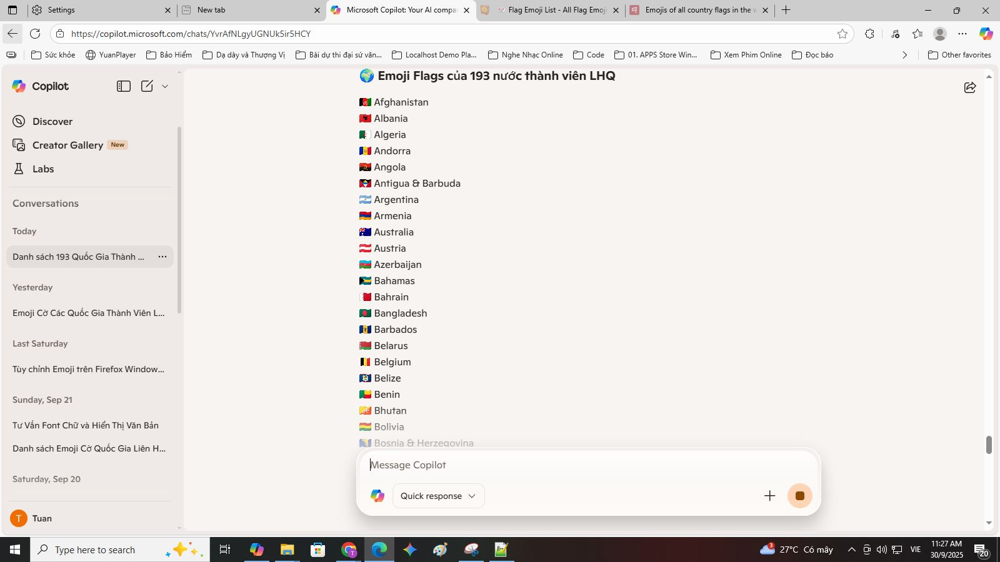

## 🇺🇸 English

### ✨ Overview
Windows 10 and 11 do not natively support full Unicode flag emojis (e.g. 🇻🇳 🇺🇸 🇯🇵 🇫🇷 🇩🇪). This repository provides a complete solution to patch your system and make flag emojis render properly across all applications.

No waiting for Microsoft updates. No half-measures. This is a full technical fix built with persistence, system-level understanding, and community support.

## 📚 Installation Guides

🌐 View other language versions:  
🇻🇳 [Tiếng Việt](./guides/windows.vi.md)  
🇺🇸 [English version](./guides/windows.en.md)  
🇨🇳 [中文版本 (China)](./guides/windows.zh.md)  
🇷🇺 [Русская версия (Russia)](./guides/windows.ru.md)

## 🌍 Emoji Picker, Unicode Version 17.0 — A Technical Discovery About the Emoji Flags Mod for Windows 10

### ✅ Recommended Installation Steps

This is a curious discovery: by installing the `Segoe.UI.Emoji.with.Twemoji.Flags.ttf` font, I was able to:

- Enjoy the Windows 11-style emoji picker  
- Fully display Unicode 17.0 emojis (🫨🫠🫷🫸)  
- Render colorful national flag emojis (🇻🇳🇺🇸🇯🇵)

---

### 🔹 Step 1: Follow the setup guide 🇬🇧 [English](./guides/windows.en.md)

### 🔹 Step 2: Install the font that supports national flag emojis

📁 Font: [`Segoe.UI.Emoji.with.Twemoji.Flags.ttf`](https://github.com/Chasmical/flag-emojis-for-windows)  
📁 Or download from: [`/fonts/`](https://github.com/tuannvbg/unicode-flags-for-windows/tree/main/fonts)

- ✅ Displays full-color flag emojis (e.g. 🇯🇵🇫🇷🇧🇷)  
- ✅ Works with the Windows emoji picker (`Win + .`)  
- 🧩 Combines Segoe UI Emoji v1.60 with Twemoji v16.0.1  
- 📌 This font complements the base font — it does not fully replace it

---

### 🔍 Technical Insight: Font Stacking to Expand Emoji Support

The `seguiemj_1_31_mod.ttf` font already supports flag emojis, but since it's based on the original Windows 10 font, the emoji visuals are outdated — not as polished as Fluent 3D in Windows 11.

→ That’s why I tried installing `Segoe.UI.Emoji.with.Twemoji.Flags.ttf` by Chasmical to:

- ✅ Retain full-color flag emojis  
- ✅ Enjoy Fluent-style emoji visuals from Windows 11 (based on Segoe UI Emoji v1.60)  
- ✅ Combine with `seguiemj_1_31_mod.ttf` to add Unicode 17.0 support (🫨🫠🫷🫸)

📌 Technical explanation:

- Chasmical’s font does not replace all emojis — it only adds 258 flag emojis from Twemoji v16.0.1  
- The rest of the emoji set remains from Segoe UI Emoji v1.60 — Fluent 3D 15.1 (Windows 11 23H2, dated 2024-06-25)  
- From Chasmical’s repo:

  > *“This font is based on Segoe UI Emoji v1.60 (3D Fluent 15.1; Win11 23H2; 2024-06-25) and contains 258 flags from the Twitter Color Emoji SVGinOT v16.0.1 (2025-04-14) compiled by quarrel.”*

🧠 By installing `seguiemj_1_31_mod.ttf` first, the system falls back to it for rendering Unicode 17.0 emojis that Chasmical’s font doesn’t include.  
→ This is a clever font-stacking strategy:  
- The first font supplies new Unicode glyphs  
- The second font provides Fluent visuals and flag support  
→ Result: Windows 10 renders emojis like Windows 11 — but even better, with Unicode 17.0 support.

---

### 📷 Browser Font Configuration for Flag Emoji Rendering

After installing `Segoe.UI.Emoji.with.Twemoji.Flags.ttf`, I configured my browser to ensure flag emojis render in full color.

✅ Tip: Use `'Noto Color Emoji'` instead of `'Segoe UI Emoji'` to avoid blue-tinted or missing flag emojis.

---

### 📸 Real-World Illustrations

#### 🧩 Windows 11-style Emoji Picker on Windows 10

---

#### 🌐 Chrome after configuring `'Noto Color Emoji'`

---

#### 🌐 Edge after configuring `'Noto Color Emoji'`

---

#### 🔍 Chrome browsing emojipedia.org — Unicode 17.0 test

---

### 🧪 System Compatibility Table

| OS + Font Setup | Unicode 17.0 Emojis | Flag Emojis | Notes |
|------------------|----------------------|--------------|-------|
| Win10 + `seguiemj_1_31_mod.ttf` | ✅ | ✅ | Full emoji set but legacy visuals |
| Win10 + `seguiemj_1_31_mod.ttf` + Twemoji Flags | ✅ | ✅ | Full emoji set with Fluent visuals |
| Win11 + Twemoji Flags only | ❌ | ✅ | Flags only, lacks Unicode 17.0 support |

---

### 📢 Conclusion

✅ **Windows 10 can fully display national flag emojis and Unicode 17.0**,  
if fonts are installed in the correct order: **base font first**, **Twemoji Flags second**,  
and the browser is configured to use `'Noto Color Emoji'` to ensure proper flag rendering.

## 🦊 Global Challenge: Fix Unicode Flag Emoji in Firefox

> Firefox still fails to render Unicode flag emojis correctly.  
> Whoever fixes it will be honored on the [Firefox Wall of Fame](guides/firefox.wall-of-fame.en.md) 🏅

- 🌍 [View the challenge](guides/firefox.prefix.en.md)  
- 🛠️ [Submit your fix](guides/firefox.fix.template.en.md)
## 🤔 Comparison with other solutions

You may have heard of projects like:

- [`13rac1/twemoji-color-font`](https://github.com/13rac1/twemoji-color-font)
- Scripts that inject custom emoji fonts
- Using SVG images to replace emojis in browsers (Twemoji CDN, etc.)

Each solution has its pros and cons.

| Criteria                    | twemoji-color-font         | unicode-flags-for-windows     |
|----------------------------|----------------------------|-------------------------------|
| Flag emojis render correctly? | ⚠️ Possibly (depends on system) | ✅ Stable, native Unicode     |
| Other emojis in color?     | ❌ Mostly black & white     | ✅ Full color support          |
| Modifies system fonts?     | ❌ No                      | ✅ Yes (with backup)           |
| Optimized for Windows 10/11? | ❌ Not fully               | ✅ Specifically optimized      |
| Requires registry edits?   | ❌ No                      | ✅ Yes (auto/manual)           |
| Firefox support?           | ❌ Not targeted             | ❓ (currently a challenge)     |
| Active community?          | ✅ Fairly large             | 🆕 Just launched               |

📣 Want to help Firefox render flag emojis correctly?  
→ [Join the challenge here](guides/firefox.prefix.en.md) 🦊🔥
