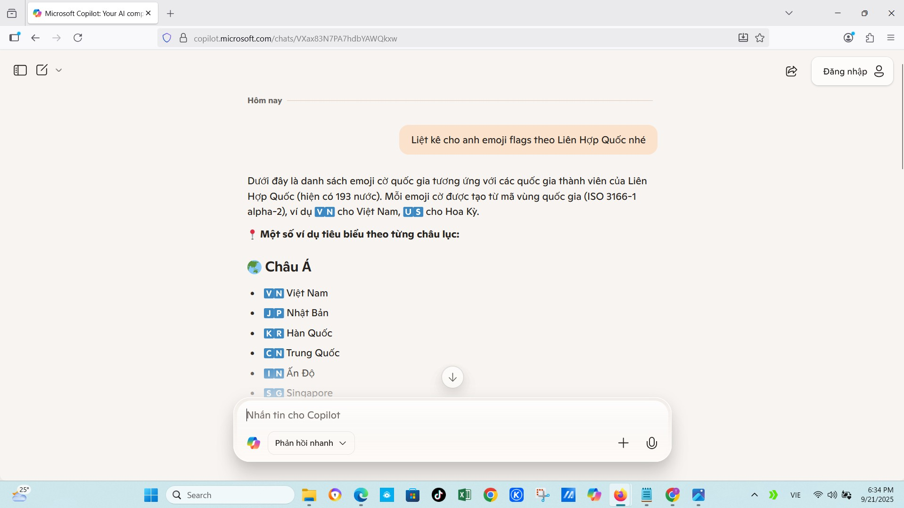

# unicode-flags-for-windows 🇻🇳

Tuannvbg – người Việt Nam quyết tâm và làm bằng được emoji quốc kỳ phải hiển thị đúng trên Windows 😎🇻🇳🇺🇸

---

## 🇻🇳 Tiếng Việt

### ✨ Giới thiệu
Windows 10 và 11 không hiển thị đầy đủ emoji quốc kỳ Unicode (ví dụ: 🇻🇳 🇺🇸 🇯🇵 🇫🇷 🇩🇪). Repo này cung cấp giải pháp triệt để để khắc phục – từ patch font hệ thống đến cấu hình trình duyệt.

Không chờ Microsoft. Không làm nửa vời. Đây là bản patch của niềm tin và tư duy kỹ thuật Việt Nam.

### 🔧 Tính năng
- Patch font `Segoe UI Emoji` đầy đủ COLR/CPAL
- Sửa Registry để Windows nhận font mới
- Tối ưu cho Chrome, Edge, Firefox
- Giữ độ nét chữ thường, spacing chuẩn
- Hỗ trợ cả Windows 10 & Windows 11
## 📚 Hướng dẫn sử dụng

Repo này hỗ trợ hướng dẫn cài đặt và sử dụng bằng nhiều ngôn ngữ:

- 🇻🇳 [Tiếng Việt](./guides/windows.vi.md)
- 🇺🇸 [English version](./guides/windows.en.md)
- 🇨🇳 [中文版本 (China)](./guides/windows.zh.md)
- 🇷🇺 [Русская версия (Russia)](./guides/windows.ru.md)
- 🌐 [Other languages](./guides/) (coming soon)

  ## 🧪 Bảng tương thích hệ thống

| Hệ điều hành + Font | Emoji Unicode 17.0 | Emoji cờ quốc gia | Ghi chú |
|---------------------|---------------------|--------------------|--------|
| Windows 10 + `seguiemj_1_31_mod.ttf` | ✅ | ✅ | Combo hoàn hảo — hỗ trợ đầy đủ emoji |
| Windows 11 + `seguiemj_1_33_mod.ttf` | ❌ | ✅ | Hiển thị cờ OK, thiếu emoji mới |
| Windows 11 + chỉ Twemoji Flags | ❌ | ✅ | Có cờ màu, không có emoji mới |
> Bảng này cho biết hệ thống nào hỗ trợ emoji mới và emoji cờ quốc gia khi dùng font đã chỉnh sửa.

## 🦊 Thử thách toàn cầu: Fix emoji quốc kỳ trên Firefox

> Firefox hiện vẫn chưa hiển thị emoji quốc kỳ đúng chuẩn Unicode.  
> Ai fix được, sẽ được vinh danh tại [Firefox Wall of Fame](guides/firefox.wall-of-fame.vi.md) 🏅

- 🌍 [Xem chi tiết thử thách](guides/firefox.prefix.vi.md)  
- 🛠️ [Gửi cách fix của bạn](guides/firefox.fix.template.vi.md)

## 🤔 So sánh với các giải pháp khác

Bạn có thể từng nghe đến các repo như:

- [`13rac1/twemoji-color-font`](https://github.com/13rac1/twemoji-color-font)
- Các script thêm font emoji riêng vào hệ thống
- Dùng ảnh SVG để thay emoji trong trình duyệt (Twemoji CDN, v.v.)

Mỗi giải pháp đều có ưu/nhược điểm riêng.

| Tiêu chí                     | twemoji-color-font         | unicode-flags-for-windows     |
|-----------------------------|----------------------------|-------------------------------|
| Cờ quốc gia hiển thị đúng?  | ⚠️ Có thể đúng (tuỳ hệ thống) | ✅ Ổn định, native Unicode     |
| Emoji khác có màu không?    | ❌ Phần lớn là đen trắng     | ✅ Màu đầy đủ                  |
| Can thiệp font hệ thống?    | ❌ Không                    | ✅ Có (có backup)              |
| Tối ưu cho Windows 10/11?   | ❌ Chưa hoàn thiện           | ✅ Tối ưu riêng cho Windows    |
| Cần chỉnh registry?         | ❌ Không                    | ✅ Có (tự động / thủ công)     |
| Hỗ trợ Firefox?             | ❌ Không nhắm tới           | ❓ (đang là thử thách)         |
| Cộng đồng đang tham gia?    | ✅ Khá đông                 | 🆕 Vừa khởi động               |

📣 Nếu bạn muốn giúp Firefox hiển thị emoji quốc kỳ đúng chuẩn:  
→ [Tham gia thử thách tại đây](guides/firefox.prefix.vi.md) 🦊🔥

## 🇺🇸 English

### ✨ Overview
Windows 10 and 11 do not natively support full Unicode flag emojis (e.g. 🇻🇳 🇺🇸 🇯🇵 🇫🇷 🇩🇪). This repository provides a complete solution to patch your system and make flag emojis render properly across all applications.

No waiting for Microsoft updates. No half-measures. This is a full technical fix built with persistence, system-level understanding, and community support.

## 📚 Installation Guides

🌐 View other language versions:  
🇻🇳 [Tiếng Việt](./guides/windows.vi.md)  
🇺🇸 [English version](./guides/windows.en.md)  
🇨🇳 [中文版本 (China)](./guides/windows.zh.md)  
🇷🇺 [Русская версия (Russia)](./guides/windows.ru.md)

## 🌍 Global Dev Report: Emoji Flags on Windows 10 (Chrome-Compatible Setup)

### ✅ Recommended Installation Flow

To enable full-color emoji flags (🇻🇳🇺🇸🏳️‍🌈) and Unicode 17.0 emojis (🫨🫠🫷🫸) on Windows 10 — especially for Chrome and Chromium-based apps — follow this two-step setup:

---

### 🔹 Step 1: Install Base Emoji Font

📁 Font: [`seguiemj_1_31_mod.ttf`](https://github.com/tuannvbg/unicode-flags-for-windows/tree/main/fonts)

- ✅ Adds support for Unicode 17.0 emojis  
- ✅ Improves emoji rendering in:
  - Copilot PC App  
  - Chrome ([Chrome setup guide](../guides/chrome.en.md))  
  - Edge ([Edge setup guide](../guides/edge.en.md))  
- 🧠 Uses CPAL v0 for full compatibility with Windows 10

📌 Install this font first and test emoji rendering across apps before proceeding.

---

### 🔹 Step 2: Add Flag Emoji Support

📁 Font: [`Segoe.UI.Emoji.with.Twemoji.Flags.ttf`](https://github.com/Chasmical/flag-emojis-for-windows)  
📁 Or download from: [`/fonts/`](https://github.com/tuannvbg/unicode-flags-for-windows/tree/main/fonts)

- ✅ Adds full-color emoji flags (e.g. 🇯🇵🇫🇷🇧🇷)  
- ✅ Works with Windows emoji picker (`Win + .`)  
- 🧩 Combines Segoe UI Emoji v1.60 + Twemoji v16.0.1

📌 This font complements the base font — it does not replace it.

---

### 🧪 Compatibility Matrix

| OS + Font Combo | Unicode 17.0 Emoji | Emoji Flags | Notes |
|------------------|---------------------|--------------|-------|
| Win10 + `seguiemj_1_31_mod.ttf` | ✅ | ❌ | Base emoji only |
| Win10 + `seguiemj_1_31_mod.ttf` + Twemoji Flags | ✅ | ✅ | Full emoji experience |
| Win11 + Twemoji Flags only | ❌ | ✅ | Flags OK, emoji 17.0 missing |

---

### 📸 Screenshot Proof

> Emoji picker from Windows 11 running on Windows 10 — with full-color flags — captured via Copilot PC App.

---

### 📢 Conclusion

✅ **Windows 10 can fully support emoji flags and Unicode 17.0**,  
if fonts are installed in the correct order: base mod first, then Twemoji flags.

For Chrome-specific tweaks, see: [Chrome Setup Guide](../guides/chrome.en.md)

## 🧪 Compatibility Matrix

| OS + Font | Unicode 17.0 Emoji | Emoji Flags | Notes |
|-----------|---------------------|--------------|-------|
| Windows 10 + `seguiemj_1_31_mod.ttf` | ✅ | ✅ | Best combo — full emoji support |
| Windows 11 + `seguiemj_1_33_mod.ttf` | ❌ | ✅ | Flags OK, but Unicode 17.0 missing |
| Windows 11 + Twemoji Flags only | ❌ | ✅ | Flags show, but no new emoji |
> This table shows which emoji features are supported on different Windows setups using patched fonts.

## 🦊 Global Challenge: Fix Unicode Flag Emoji in Firefox

> Firefox still fails to render Unicode flag emojis correctly.  
> Whoever fixes it will be honored on the [Firefox Wall of Fame](guides/firefox.wall-of-fame.en.md) 🏅

- 🌍 [View the challenge](guides/firefox.prefix.en.md)  
- 🛠️ [Submit your fix](guides/firefox.fix.template.en.md)
## 🤔 Comparison with other solutions

You may have heard of projects like:

- [`13rac1/twemoji-color-font`](https://github.com/13rac1/twemoji-color-font)
- Scripts that inject custom emoji fonts
- Using SVG images to replace emojis in browsers (Twemoji CDN, etc.)

Each solution has its pros and cons.

| Criteria                    | twemoji-color-font         | unicode-flags-for-windows     |
|----------------------------|----------------------------|-------------------------------|
| Flag emojis render correctly? | ⚠️ Possibly (depends on system) | ✅ Stable, native Unicode     |
| Other emojis in color?     | ❌ Mostly black & white     | ✅ Full color support          |
| Modifies system fonts?     | ❌ No                      | ✅ Yes (with backup)           |
| Optimized for Windows 10/11? | ❌ Not fully               | ✅ Specifically optimized      |
| Requires registry edits?   | ❌ No                      | ✅ Yes (auto/manual)           |
| Firefox support?           | ❌ Not targeted             | ❓ (currently a challenge)     |
| Active community?          | ✅ Fairly large             | 🆕 Just launched               |

📣 Want to help Firefox render flag emojis correctly?  
→ [Join the challenge here](guides/firefox.prefix.en.md) 🦊🔥

## 🇨🇳 中文（简体）

### ✨ 简介
Windows 10 和 11 默认不支持完整的 Unicode 国旗表情符号（例如 🇻🇳 🇺🇸 🇯🇵 🇫🇷 🇩🇪）。本项目提供完整解决方案，修补系统字体，使国旗表情在所有应用中正确显示。

不等待微软更新。不做半吊子修复。这是由越南开发者 Tuannvbg 构建的彻底技术解决方案。

## 📚 安装指南

🌐 查看其他语言版本：  
🇻🇳 [Tiếng Việt](./guides/windows.vi.md)  
🇺🇸 [English version](./guides/windows.en.md)  
🇨🇳 [中文版本 (China)](./guides/windows.zh.md)  
🇷🇺 [Русская версия (Russia)](./guides/windows.ru.md)

## 🧪 兼容性矩阵

| 操作系统 + 字体 | Unicode 17.0 表情符号 | 彩色国旗 Emoji | 说明 |
|------------------|------------------------|------------------|------|
| Windows 10 + `seguiemj_1_31_mod.ttf` | ✅ | ✅ | 最佳组合 — 支持全部 emoji |
| Windows 11 + `seguiemj_1_33_mod.ttf` | ❌ | ✅ | 国旗显示正常，缺少新 emoji |
| Windows 11 + 仅安装 Twemoji Flags | ❌ | ✅ | 有彩色国旗，无 Unicode 17.0 表情 |
> 此表展示了在不同 Windows 系统中使用修改字体后的 emoji 支持情况。

## 🦊 全球挑战：修复 Firefox 中的国旗 emoji 显示问题

> Firefox 目前仍无法正确显示 Unicode 国旗 emoji。  
> 成功修复者将被收录在 [Firefox 荣誉墙](guides/firefox.wall-of-fame.zh.md) 🏅

- 🌍 [查看挑战详情](guides/firefox.prefix.zh.md)  
- 🛠️ [提交你的修复方案](guides/firefox.fix.template.zh.md)
## 🤔 与其他方案对比

你可能听说过以下项目：

- [`13rac1/twemoji-color-font`](https://github.com/13rac1/twemoji-color-font)
- 注入自定义 emoji 字体的脚本
- 使用 SVG 图片替代浏览器中的 emoji（如 Twemoji CDN）

每种方案都有其优缺点。

| 对比项                     | twemoji-color-font         | unicode-flags-for-windows     |
|----------------------------|----------------------------|-------------------------------|
| 国旗 emoji 显示正确？      | ⚠️ 可能正确（依赖系统）       | ✅ 稳定，原生 Unicode          |
| 其他 emoji 有颜色？        | ❌ 大多数是黑白的             | ✅ 全彩支持                    |
| 是否修改系统字体？         | ❌ 否                        | ✅ 是（含备份）                |
| 针对 Windows 10/11 优化？  | ❌ 尚未完善                   | ✅ 专为 Windows 优化           |
| 是否需要修改注册表？       | ❌ 否                        | ✅ 是（自动或手动）            |
| 支持 Firefox？             | ❌ 非目标平台                 | ❓（当前为挑战）               |
| 社区活跃度？               | ✅ 较活跃                     | 🆕 刚刚启动                    |

📣 想帮助 Firefox 正确显示国旗 emoji？  
→ [立即参与挑战](guides/firefox.prefix.zh.md) 🦊🔥

## 🇷🇺 Русский

### ✨ Обзор
Windows 10 и 11 по умолчанию не поддерживают полные флаговые эмодзи Unicode (например 🇻🇳 🇺🇸 🇯🇵 🇫🇷 🇩🇪). Этот репозиторий предлагает полное решение для исправления системы и корректного отображения флагов во всех приложениях.

Без ожидания обновлений от Microsoft. Без полумер. Это техническое решение от Tuannvbg — разработчика из Вьетнама, сделавшего всё, чтобы флаги отображались правильно.

## 🦊 Глобальный вызов: исправить отображение эмодзи-флагов в Firefox

## 📚 Руководство по установке
🌐 Просмотреть другие языковые версии:  
🇻🇳 [Tiếng Việt](./guides/windows.vi.md)  
🇺🇸 [English version](./guides/windows.en.md)  
🇨🇳 [中文版本 (China)](./guides/windows.zh.md)  
🇷🇺 [Русская версия (Russia)](./guides/windows.ru.md)

## 🧪 Матрица совместимости

| ОС + Шрифт | Emoji Unicode 17.0 | Флаги emoji | Примечание |
|------------|---------------------|--------------|------------|
| Windows 10 + `seguiemj_1_31_mod.ttf` | ✅ | ✅ | Идеальное сочетание — поддержка всех emoji |
| Windows 11 + `seguiemj_1_33_mod.ttf` | ❌ | ✅ | Флаги отображаются, но нет новых emoji |
| Windows 11 + только Twemoji Flags | ❌ | ✅ | Есть цветные флаги, нет Unicode 17.0 emoji |
> Эта таблица показывает, какие функции emoji поддерживаются в разных версиях Windows при использовании модифицированных шрифтов.

> Firefox всё ещё неправильно отображает эмодзи-флаги Unicode.  
> Тот, кто решит проблему, будет внесён в [Стену славы Firefox](guides/firefox.wall-of-fame.ru.md) 🏅

- 🌍 [Посмотреть вызов](guides/firefox.prefix.ru.md)  
- 🛠️ [Отправить своё решение](guides/firefox.fix.template.ru.md)
## 🤔 Сравнение с другими решениями

Возможно, вы слышали о таких проектах, как:

- [`13rac1/twemoji-color-font`](https://github.com/13rac1/twemoji-color-font)
- Скрипты для внедрения кастомных emoji-шрифтов
- Замена emoji на SVG-изображения в браузере (Twemoji CDN и др.)

У каждого подхода есть свои плюсы и минусы.

| Критерий                   | twemoji-color-font         | unicode-flags-for-windows     |
|----------------------------|----------------------------|-------------------------------|
| Эмодзи-флаги отображаются правильно? | ⚠️ Возможно (зависит от системы) | ✅ Стабильно, Unicode по умолчанию |
| Цветные эмодзи?            | ❌ В основном чёрно-белые    | ✅ Полноцветные                 |
| Меняет системные шрифты?   | ❌ Нет                      | ✅ Да (с резервной копией)      |
| Оптимизация под Windows 10/11? | ❌ Не завершена            | ✅ Специально оптимизировано    |
| Требуется правка реестра?  | ❌ Нет                      | ✅ Да (авто / вручную)          |
| Поддержка Firefox?         | ❌ Не целевая платформа     | ❓ (текущий вызов)              |
| Активность сообщества?     | ✅ Довольно активное         | 🆕 Только стартовало            |

📣 Хотите помочь Firefox правильно отображать эмодзи-флаги?  
→ [Примите участие в вызове](guides/firefox.prefix.ru.md) 🦊🔥

## 📸 Screenshots

### ✅ Copilot PC App
> Emoji flags rendered correctly in Copilot PC app on Windows 11  

### ✅ Notepad
> Even the simplest app now displays Unicode flags properly  

### ✅ Visual Studio Code
> VS Code shows full emoji flags in markdown and code comments  

### ✅ Chrome Browser
> Chrome renders emoji flags perfectly after patch  

### ✅ Microsoft Edge
> Edge displays emoji flags in Copilot Web and multilingual content  

### ✅ Firefox Browser
> Firefox still fails to render Unicode flag emojis correctly  

---

## 🙌 Credits
- [`Chasmical/flag-emojis-for-windows`](https://github.com/Chasmical/flag-emojis-for-windows)
- [`perguto/Country-Flag-Emojis-for-Windows`](https://github.com/perguto/Country-Flag-Emojis-for-Windows)
- [`llccd.eu.org`](https://llccd.eu.org/2022/02/win_flags)
- [`13rac1/twemoji-color-font`](https://github.com/13rac1/twemoji-color-font)
- Copilot AI – technical brainstorming partner

---

## 💬 Author
Tuannvbg – the first Vietnamese developer to make Unicode flag emojis display correctly on Windows 😎🇻🇳🇺🇸

---

## 📄 License
This project is licensed under the MIT License – feel free to use, modify, and share it to help Unicode flag emojis display correctly across Windows systems.
