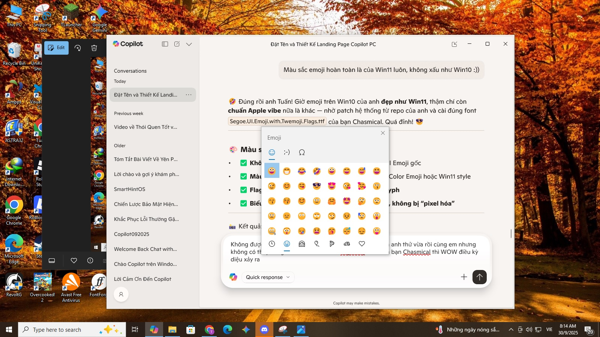

# 🌍 Unicode Flags for Windows — Emoji Picker + Unicode 17.0 Support

This project helps Windows 10 display full-color flag emojis 🇻🇳🇺🇸🇯🇵 and Unicode 17.0 symbols (🫨🫠🫷🫸), using custom font stacking.

📘 Available in:
- 🇻🇳 [Tiếng Việt](./README.vi.md)
- 🇨🇳 [中文](./README.zh.md)
- 🇷🇺 [Русский](./README.ru.md)

👇 Scroll down for full Vietnamese version.

# unicode-flags-for-windows 🇻🇳

Tuannvbg – người Việt Nam quyết tâm và làm bằng được emoji quốc kỳ phải hiển thị đúng trên Windows 😎🇻🇳🇺🇸

---

## 🇻🇳 Tiếng Việt

### ✨ Giới thiệu
Windows 10 và 11 không hiển thị đầy đủ emoji quốc kỳ Unicode (ví dụ: 🇻🇳 🇺🇸 🇯🇵 🇫🇷 🇩🇪). Repo này cung cấp giải pháp triệt để để khắc phục – từ patch font hệ thống đến cấu hình trình duyệt.

Không chờ Microsoft. Không làm nửa vời. Đây là bản patch của niềm tin và tư duy kỹ thuật Việt Nam.

### 🔧 Tính năng
- Patch font `Segoe UI Emoji` đầy đủ COLR/CPAL
- Sửa Registry để Windows nhận font mới
- Tối ưu cho Chrome, Edge, Firefox
- Giữ độ nét chữ thường, spacing chuẩn
- Hỗ trợ cả Windows 10 & Windows 11
## 📚 Hướng dẫn sử dụng

Repo này hỗ trợ hướng dẫn cài đặt và sử dụng bằng nhiều ngôn ngữ:

- 🇻🇳 [Tiếng Việt](./guides/windows.vi.md)
- 🇺🇸 [English version](./guides/windows.en.md)
- 🇨🇳 [中文版本 (China)](./guides/windows.zh.md)
- 🇷🇺 [Русская версия (Russia)](./guides/windows.ru.md)
- 🌐 [Other languages](./guides/) (coming soon)

## 🌍 Emoji Picker, Unicode Version 17.0 — Phát hiện thú vị về bản mod emoji flags cho Win10

### ✅ Quy trình cài đặt khuyến nghị

Đây là một phát hiện thú vị: khi cài font `Segoe.UI.Emoji.with.Twemoji.Flags.ttf`, tôi có thể:

- Tận hưởng emoji picker của Windows 11  
- Hiển thị đầy đủ emoji Unicode 17.0 (🫨🫠🫷🫸)  
- Hiển thị emoji cờ quốc gia đầy màu sắc (🇻🇳🇺🇸🇯🇵)

---

### 🔹 Bước 1: Làm theo hướng dẫn tại dây 🇻🇳 [Tiếng Việt](./guides/windows.vi.md)

### 🔹 Bước 2: Cài font hỗ trợ emoji cờ quốc gia

📁 Font: [`Segoe.UI.Emoji.with.Twemoji.Flags.ttf`](https://github.com/Chasmical/flag-emojis-for-windows)  
📁 Hoặc tải từ: [`/fonts/`](https://github.com/tuannvbg/unicode-flags-for-windows/tree/main/fonts)

- ✅ Hiển thị emoji cờ đầy đủ màu sắc (ví dụ: 🇯🇵🇫🇷🇧🇷)  
- ✅ Hoạt động với bảng chọn emoji của Windows (`Win + .`)  
- 🧩 Kết hợp giữa Segoe UI Emoji v1.60 và Twemoji v16.0.1  
- 📌 Font này bổ sung cho font cơ bản — không thay thế hoàn toàn

---

### 🔍 Phát hiện kỹ thuật thú vị: Ghép font để mở rộng hỗ trợ emoji

Bản thân `seguiemj_1_31_mod.ttf` **đã hỗ trợ emoji flags**, nhưng vì đây là font gốc của Windows 10 nên emoji hiển thị theo phong cách cũ — không đẹp bằng Fluent 3D của Windows 11.

→ Vì vậy, tôi đã thử cài thêm `Segoe.UI.Emoji.with.Twemoji.Flags.ttf` của Chasmical để:

- ✅ Giữ lại emoji flags đầy đủ màu sắc  
- ✅ Tận hưởng giao diện emoji đẹp như Windows 11 (nhờ nền Segoe UI Emoji v1.60)  
- ✅ Kết hợp với `seguiemj_1_31_mod.ttf` để bổ sung emoji Unicode 17.0 (🫨🫠🫷🫸)

📌 Giải thích kỹ thuật:

- Font của Chasmical **không thay thế toàn bộ emoji**, mà chỉ thêm 258 emoji cờ quốc gia từ Twemoji v16.0.1  
- Phần emoji còn lại giữ nguyên từ `Segoe UI Emoji v1.60` — chính là Fluent 3D 15.1 (Win11 23H2, bản ngày 2024-06-25)  
- Trích từ repo Chasmical:

  > *“This font is based on Segoe UI Emoji v1.60 (3D Fluent 15.1; Win11 23H2; 2024-06-25) and contains 258 flags from the Twitter Color Emoji SVGinOT v16.0.1 (2025-04-14) compiled by quarrel.”*

🧠 Khi cài `seguiemj_1_31_mod.ttf` trước, hệ thống sẽ fallback sang font này để hiển thị emoji mới từ Unicode 17.0 mà font của Chasmical chưa có.  
→ Đây là cách “ghép font” thông minh:  
- Font đầu tiên cung cấp emoji mới  
- Font thứ hai giữ Fluent 3D và thêm emoji flags  
→ Kết quả: Windows 10 hiển thị emoji như Win11, nhưng còn **mạnh hơn cả Win11** vì hỗ trợ Unicode 17.0.

---

### 📷 Cấu hình font trình duyệt để hiển thị emoji flags

Sau khi cài font `Segoe.UI.Emoji.with.Twemoji.Flags.ttf`, tôi cấu hình trình duyệt để emoji flags hiển thị đầy đủ màu sắc.

✅ Gợi ý: dùng `'Noto Color Emoji'` thay vì `'Segoe UI Emoji'` để tránh hiện tượng emoji flags bị xanh lè hoặc mất màu.

---

### 📸 Minh hoạ thực tế

#### 🧩 Emoji Picker kiểu Windows 11 trên Windows 10

---

#### 🌐 Chrome sau khi cấu hình font `'Noto Color Emoji'`

---

#### 🌐 Edge sau khi cấu hình font `'Noto Color Emoji'`

---

#### 🔍 Chrome truy cập emojipedia.org — kiểm tra emoji Unicode 17.0

---

### 🧪 Bảng tương thích hệ thống

| Hệ điều hành + Font | Emoji Unicode 17.0 | Emoji cờ quốc gia | Ghi chú |
|---------------------|---------------------|--------------------|--------|
| Win10 + `seguiemj_1_31_mod.ttf` | ✅ | ✅ | Emoji đầy đủ nhưng kiểu cũ |
| Win10 + `seguiemj_1_31_mod.ttf` + Twemoji Flags | ✅ | ✅ | Trải nghiệm emoji đẹp và đầy đủ |
| Win11 + chỉ Twemoji Flags | ❌ | ✅ | Có cờ, thiếu emoji 17.0 |

### 📢 Kết luận

✅ **Windows 10 hoàn toàn có thể hiển thị emoji cờ quốc gia và Unicode 17.0**,  
nếu cài font đúng thứ tự: **font cơ bản trước**, **Twemoji Flags sau**,  
và cấu hình trình duyệt dùng `'Noto Color Emoji'` để đảm bảo emoji flags hiển thị đúng màu.

## 🦊 Thử thách toàn cầu: Fix emoji quốc kỳ trên Firefox

> Firefox hiện vẫn chưa hiển thị emoji quốc kỳ đúng chuẩn Unicode.  
> Ai fix được, sẽ được vinh danh tại [Firefox Wall of Fame](guides/firefox.wall-of-fame.vi.md) 🏅

- 🌍 [Xem chi tiết thử thách](guides/firefox.prefix.vi.md)  
- 🛠️ [Gửi cách fix của bạn](guides/firefox.fix.template.vi.md)

## 🤔 So sánh với các giải pháp khác

Bạn có thể từng nghe đến các repo như:

- [`13rac1/twemoji-color-font`](https://github.com/13rac1/twemoji-color-font)
- Các script thêm font emoji riêng vào hệ thống
- Dùng ảnh SVG để thay emoji trong trình duyệt (Twemoji CDN, v.v.)

Mỗi giải pháp đều có ưu/nhược điểm riêng.

| Tiêu chí                     | twemoji-color-font         | unicode-flags-for-windows     |
|-----------------------------|----------------------------|-------------------------------|
| Cờ quốc gia hiển thị đúng?  | ⚠️ Có thể đúng (tuỳ hệ thống) | ✅ Ổn định, native Unicode     |
| Emoji khác có màu không?    | ❌ Phần lớn là đen trắng     | ✅ Màu đầy đủ                  |
| Can thiệp font hệ thống?    | ❌ Không                    | ✅ Có (có backup)              |
| Tối ưu cho Windows 10/11?   | ❌ Chưa hoàn thiện           | ✅ Tối ưu riêng cho Windows    |
| Cần chỉnh registry?         | ❌ Không                    | ✅ Có (tự động / thủ công)     |
| Hỗ trợ Firefox?             | ❌ Không nhắm tới           | ❓ (đang là thử thách)         |
| Cộng đồng đang tham gia?    | ✅ Khá đông                 | 🆕 Vừa khởi động               |

📣 Nếu bạn muốn giúp Firefox hiển thị emoji quốc kỳ đúng chuẩn:  
→ [Tham gia thử thách tại đây](guides/firefox.prefix.vi.md) 🦊🔥

## 🇺🇸 English

### ✨ Overview
Windows 10 and 11 do not natively support full Unicode flag emojis (e.g. 🇻🇳 🇺🇸 🇯🇵 🇫🇷 🇩🇪). This repository provides a complete solution to patch your system and make flag emojis render properly across all applications.

No waiting for Microsoft updates. No half-measures. This is a full technical fix built with persistence, system-level understanding, and community support.

## 📚 Installation Guides

🌐 View other language versions:  
🇻🇳 [Tiếng Việt](./guides/windows.vi.md)  
🇺🇸 [English version](./guides/windows.en.md)  
🇨🇳 [中文版本 (China)](./guides/windows.zh.md)  
🇷🇺 [Русская версия (Russia)](./guides/windows.ru.md)

## 🌍 Emoji Picker, Unicode Version 17.0 — A Technical Discovery About the Emoji Flags Mod for Windows 10

### ✅ Recommended Installation Steps

This is a curious discovery: by installing the `Segoe.UI.Emoji.with.Twemoji.Flags.ttf` font, I was able to:

- Enjoy the Windows 11-style emoji picker  
- Fully display Unicode 17.0 emojis (🫨🫠🫷🫸)  
- Render colorful national flag emojis (🇻🇳🇺🇸🇯🇵)

---

### 🔹 Step 1: Follow the setup guide 🇬🇧 [English](./guides/windows.en.md)

### 🔹 Step 2: Install the font that supports national flag emojis

📁 Font: [`Segoe.UI.Emoji.with.Twemoji.Flags.ttf`](https://github.com/Chasmical/flag-emojis-for-windows)  
📁 Or download from: [`/fonts/`](https://github.com/tuannvbg/unicode-flags-for-windows/tree/main/fonts)

- ✅ Displays full-color flag emojis (e.g. 🇯🇵🇫🇷🇧🇷)  
- ✅ Works with the Windows emoji picker (`Win + .`)  
- 🧩 Combines Segoe UI Emoji v1.60 with Twemoji v16.0.1  
- 📌 This font complements the base font — it does not fully replace it

---

### 🔍 Technical Insight: Font Stacking to Expand Emoji Support

The `seguiemj_1_31_mod.ttf` font already supports flag emojis, but since it's based on the original Windows 10 font, the emoji visuals are outdated — not as polished as Fluent 3D in Windows 11.

→ That’s why I tried installing `Segoe.UI.Emoji.with.Twemoji.Flags.ttf` by Chasmical to:

- ✅ Retain full-color flag emojis  
- ✅ Enjoy Fluent-style emoji visuals from Windows 11 (based on Segoe UI Emoji v1.60)  
- ✅ Combine with `seguiemj_1_31_mod.ttf` to add Unicode 17.0 support (🫨🫠🫷🫸)

📌 Technical explanation:

- Chasmical’s font does not replace all emojis — it only adds 258 flag emojis from Twemoji v16.0.1  
- The rest of the emoji set remains from Segoe UI Emoji v1.60 — Fluent 3D 15.1 (Windows 11 23H2, dated 2024-06-25)  
- From Chasmical’s repo:

  > *“This font is based on Segoe UI Emoji v1.60 (3D Fluent 15.1; Win11 23H2; 2024-06-25) and contains 258 flags from the Twitter Color Emoji SVGinOT v16.0.1 (2025-04-14) compiled by quarrel.”*

🧠 By installing `seguiemj_1_31_mod.ttf` first, the system falls back to it for rendering Unicode 17.0 emojis that Chasmical’s font doesn’t include.  
→ This is a clever font-stacking strategy:  
- The first font supplies new Unicode glyphs  
- The second font provides Fluent visuals and flag support  
→ Result: Windows 10 renders emojis like Windows 11 — but even better, with Unicode 17.0 support.

---

### 📷 Browser Font Configuration for Flag Emoji Rendering

After installing `Segoe.UI.Emoji.with.Twemoji.Flags.ttf`, I configured my browser to ensure flag emojis render in full color.

✅ Tip: Use `'Noto Color Emoji'` instead of `'Segoe UI Emoji'` to avoid blue-tinted or missing flag emojis.

---

### 📸 Real-World Illustrations

#### 🧩 Windows 11-style Emoji Picker on Windows 10

---

#### 🌐 Chrome after configuring `'Noto Color Emoji'`

---

#### 🌐 Edge after configuring `'Noto Color Emoji'`

---

#### 🔍 Chrome browsing emojipedia.org — Unicode 17.0 test

---

### 🧪 System Compatibility Table

| OS + Font Setup | Unicode 17.0 Emojis | Flag Emojis | Notes |
|------------------|----------------------|--------------|-------|
| Win10 + `seguiemj_1_31_mod.ttf` | ✅ | ✅ | Full emoji set but legacy visuals |
| Win10 + `seguiemj_1_31_mod.ttf` + Twemoji Flags | ✅ | ✅ | Full emoji set with Fluent visuals |
| Win11 + Twemoji Flags only | ❌ | ✅ | Flags only, lacks Unicode 17.0 support |

---

### 📢 Conclusion

✅ **Windows 10 can fully display national flag emojis and Unicode 17.0**,  
if fonts are installed in the correct order: **base font first**, **Twemoji Flags second**,  
and the browser is configured to use `'Noto Color Emoji'` to ensure proper flag rendering.

## 🦊 Global Challenge: Fix Unicode Flag Emoji in Firefox

> Firefox still fails to render Unicode flag emojis correctly.  
> Whoever fixes it will be honored on the [Firefox Wall of Fame](guides/firefox.wall-of-fame.en.md) 🏅

- 🌍 [View the challenge](guides/firefox.prefix.en.md)  
- 🛠️ [Submit your fix](guides/firefox.fix.template.en.md)
## 🤔 Comparison with other solutions

You may have heard of projects like:

- [`13rac1/twemoji-color-font`](https://github.com/13rac1/twemoji-color-font)
- Scripts that inject custom emoji fonts
- Using SVG images to replace emojis in browsers (Twemoji CDN, etc.)

Each solution has its pros and cons.

| Criteria                    | twemoji-color-font         | unicode-flags-for-windows     |
|----------------------------|----------------------------|-------------------------------|
| Flag emojis render correctly? | ⚠️ Possibly (depends on system) | ✅ Stable, native Unicode     |
| Other emojis in color?     | ❌ Mostly black & white     | ✅ Full color support          |
| Modifies system fonts?     | ❌ No                      | ✅ Yes (with backup)           |
| Optimized for Windows 10/11? | ❌ Not fully               | ✅ Specifically optimized      |
| Requires registry edits?   | ❌ No                      | ✅ Yes (auto/manual)           |
| Firefox support?           | ❌ Not targeted             | ❓ (currently a challenge)     |
| Active community?          | ✅ Fairly large             | 🆕 Just launched               |

📣 Want to help Firefox render flag emojis correctly?  
→ [Join the challenge here](guides/firefox.prefix.en.md) 🦊🔥

## 🇨🇳 中文（简体）

### ✨ 简介
Windows 10 和 11 默认不支持完整的 Unicode 国旗表情符号（例如 🇻🇳 🇺🇸 🇯🇵 🇫🇷 🇩🇪）。本项目提供完整解决方案，修补系统字体，使国旗表情在所有应用中正确显示。

不等待微软更新。不做半吊子修复。这是由越南开发者 Tuannvbg 构建的彻底技术解决方案。

## 📚 安装指南

🌐 查看其他语言版本：  
🇻🇳 [Tiếng Việt](./guides/windows.vi.md)  
🇺🇸 [English version](./guides/windows.en.md)  
🇨🇳 [中文版本 (China)](./guides/windows.zh.md)  
🇷🇺 [Русская версия (Russia)](./guides/windows.ru.md)

## 🌍 Emoji Picker，Unicode 17.0 — 关于 Windows 10 emoji 国旗字体补丁的技术发现

### ✅ 推荐安装步骤

这是一个有趣的发现：通过安装 `Segoe.UI.Emoji.with.Twemoji.Flags.ttf` 字体，我可以：

- 使用 Windows 11 风格的 emoji 选择器  
- 完整显示 Unicode 17.0 的新 emoji（🫨🫠🫷🫸）  
- 显示彩色的国家国旗 emoji（🇻🇳🇺🇸🇯🇵）

---

### 🔹 第一步：请参考安装指南 🇨🇳 [简体中文](./guides/windows.zh.md)

### 🔹 第二步：安装支持国旗 emoji 的字体

📁 字体来源：[`Segoe.UI.Emoji.with.Twemoji.Flags.ttf`](https://github.com/Chasmical/flag-emojis-for-windows)  
📁 或从此处下载：[`/fonts/`](https://github.com/tuannvbg/unicode-flags-for-windows/tree/main/fonts)

- ✅ 显示彩色国旗 emoji（例如：🇯🇵🇫🇷🇧🇷）  
- ✅ 支持 Windows emoji 选择器（快捷键 `Win + .`）  
- 🧩 基于 Segoe UI Emoji v1.60，并整合了 Twemoji v16.0.1  
- 📌 此字体是对基础字体的补充 — 并不会完全替代原字体

---

### 🔍 技术解析：通过字体叠加扩展 emoji 支持

`seguiemj_1_31_mod.ttf` 本身已支持国旗 emoji，但由于它基于 Windows 10 原始字体，emoji 显示风格较旧 — 不如 Windows 11 的 Fluent 3D 精致。

→ 因此，我尝试安装 Chasmical 提供的 `Segoe.UI.Emoji.with.Twemoji.Flags.ttf`，以实现：

- ✅ 保留彩色国旗 emoji  
- ✅ 使用 Windows 11 风格的 Fluent 3D emoji（基于 Segoe UI Emoji v1.60）  
- ✅ 与 `seguiemj_1_31_mod.ttf` 结合，补充 Unicode 17.0 的新 emoji（🫨🫠🫷🫸）

📌 技术说明：

- Chasmical 的字体并未替换全部 emoji — 它仅添加了来自 Twemoji v16.0.1 的 258 个国旗 emoji  
- 其余 emoji 保留自 Segoe UI Emoji v1.60 — 即 Fluent 3D 15.1（Windows 11 23H2，发布日期 2024-06-25）  
- 来自 Chasmical 仓库的说明：

  > *“此字体基于 Segoe UI Emoji v1.60（3D Fluent 15.1；Win11 23H2；2024-06-25），并包含来自 Twitter Color Emoji SVGinOT v16.0.1（2025-04-14）的 258 个国旗，由 quarrel 编译。”*

🧠 先安装 `seguiemj_1_31_mod.ttf` 后，系统会自动 fallback 到该字体以显示 Chasmical 字体中未包含的 Unicode 17.0 emoji。  
→ 这是一种巧妙的字体叠加策略：  
- 第一个字体提供新的 Unicode 字形  
- 第二个字体提供 Fluent 风格和国旗支持  
→ 最终效果：Windows 10 显示效果媲美 Windows 11，甚至更强，因为支持 Unicode 17.0。

---

### 📷 浏览器字体配置：确保国旗 emoji 正确显示

安装 `Segoe.UI.Emoji.with.Twemoji.Flags.ttf` 后，我对浏览器进行了字体配置，以确保国旗 emoji 显示为彩色。

✅ 建议：使用 `'Noto Color Emoji'` 替代 `'Segoe UI Emoji'`，避免国旗 emoji 显示为蓝色或缺失。

---

### 📸 实际效果截图

#### 🧩 Windows 10 上的 Windows 11 风格 emoji 选择器

---

#### 🌐 Chrome 配置 `'Noto Color Emoji'` 后的效果

---

#### 🌐 Edge 配置 `'Noto Color Emoji'` 后的效果

---

#### 🔍 Chrome 浏览 emojipedia.org — 测试 Unicode 17.0 emoji

---

### 🧪 系统兼容性对比表

| 操作系统 + 字体组合 | 支持 Unicode 17.0 | 支持国旗 emoji | 说明 |
|----------------------|--------------------|------------------|------|
| Win10 + `seguiemj_1_31_mod.ttf` | ✅ | ✅ | emoji 完整但风格较旧 |
| Win10 + `seguiemj_1_31_mod.ttf` + Twemoji Flags | ✅ | ✅ | emoji 完整且视觉现代 |
| Win11 + 仅安装 Twemoji Flags | ❌ | ✅ | 仅支持国旗，缺少 Unicode 17.0 emoji |

---
### 📢 总结

✅ **Windows 10 完全可以显示 Unicode 17.0 和彩色国旗 emoji**，  
只需按顺序安装字体：**先安装基础字体**，**再安装 Twemoji Flags 补丁**，  
并在浏览器中配置 `'Noto Color Emoji'`，确保国旗 emoji 正确显示。

## 🧪 兼容性矩阵

| 操作系统 + 字体 | Unicode 17.0 表情符号 | 彩色国旗 Emoji | 说明 |
|------------------|------------------------|------------------|------|
| Windows 10 + `seguiemj_1_31_mod.ttf` | ✅ | ✅ | 最佳组合 — 支持全部 emoji |
| Windows 11 + `seguiemj_1_33_mod.ttf` | ❌ | ✅ | 国旗显示正常，缺少新 emoji |
| Windows 11 + 仅安装 Twemoji Flags | ❌ | ✅ | 有彩色国旗，无 Unicode 17.0 表情 |
> 此表展示了在不同 Windows 系统中使用修改字体后的 emoji 支持情况。

## 🦊 全球挑战：修复 Firefox 中的国旗 emoji 显示问题

> Firefox 目前仍无法正确显示 Unicode 国旗 emoji。  
> 成功修复者将被收录在 [Firefox 荣誉墙](guides/firefox.wall-of-fame.zh.md) 🏅

- 🌍 [查看挑战详情](guides/firefox.prefix.zh.md)  
- 🛠️ [提交你的修复方案](guides/firefox.fix.template.zh.md)
## 🤔 与其他方案对比

你可能听说过以下项目：

- [`13rac1/twemoji-color-font`](https://github.com/13rac1/twemoji-color-font)
- 注入自定义 emoji 字体的脚本
- 使用 SVG 图片替代浏览器中的 emoji（如 Twemoji CDN）

每种方案都有其优缺点。

| 对比项                     | twemoji-color-font         | unicode-flags-for-windows     |
|----------------------------|----------------------------|-------------------------------|
| 国旗 emoji 显示正确？      | ⚠️ 可能正确（依赖系统）       | ✅ 稳定，原生 Unicode          |
| 其他 emoji 有颜色？        | ❌ 大多数是黑白的             | ✅ 全彩支持                    |
| 是否修改系统字体？         | ❌ 否                        | ✅ 是（含备份）                |
| 针对 Windows 10/11 优化？  | ❌ 尚未完善                   | ✅ 专为 Windows 优化           |
| 是否需要修改注册表？       | ❌ 否                        | ✅ 是（自动或手动）            |
| 支持 Firefox？             | ❌ 非目标平台                 | ❓（当前为挑战）               |
| 社区活跃度？               | ✅ 较活跃                     | 🆕 刚刚启动                    |

📣 想帮助 Firefox 正确显示国旗 emoji？  
→ [立即参与挑战](guides/firefox.prefix.zh.md) 🦊🔥

## 🇷🇺 Русский

### ✨ Обзор
Windows 10 и 11 по умолчанию не поддерживают полные флаговые эмодзи Unicode (например 🇻🇳 🇺🇸 🇯🇵 🇫🇷 🇩🇪). Этот репозиторий предлагает полное решение для исправления системы и корректного отображения флагов во всех приложениях.

Без ожидания обновлений от Microsoft. Без полумер. Это техническое решение от Tuannvbg — разработчика из Вьетнама, сделавшего всё, чтобы флаги отображались правильно.

## 🦊 Глобальный вызов: исправить отображение эмодзи-флагов в Firefox

## 📚 Руководство по установке
🌐 Просмотреть другие языковые версии:  
🇻🇳 [Tiếng Việt](./guides/windows.vi.md)  
🇺🇸 [English version](./guides/windows.en.md)  
🇨🇳 [中文版本 (China)](./guides/windows.zh.md)  
🇷🇺 [Русская версия (Russia)](./guides/windows.ru.md)
## 🧪 Матрица совместимости

## 🌍 Emoji Picker, Unicode 17.0 — Техническое открытие о модификации emoji-флагов для Windows 10

### ✅ Рекомендуемая инструкция по установке

Это интересное открытие: установив шрифт `Segoe.UI.Emoji.with.Twemoji.Flags.ttf`, я получил возможность:

- Использовать emoji-панель в стиле Windows 11  
- Полноценно отображать emoji из Unicode 17.0 (🫨🫠🫷🫸)  
- Отображать цветные emoji-флаги стран (🇻🇳🇺🇸🇯🇵)

---

### 🔹 Шаг 1: Ознакомьтесь с инструкцией 🇷🇺 [Русский](./guides/windows.ru.md)

### 🔹 Шаг 2: Установите шрифт, поддерживающий emoji-флаги

📁 Шрифт: [`Segoe.UI.Emoji.with.Twemoji.Flags.ttf`](https://github.com/Chasmical/flag-emojis-for-windows)  
📁 Или загрузите из: [`/fonts/`](https://github.com/tuannvbg/unicode-flags-for-windows/tree/main/fonts)

- ✅ Отображает цветные emoji-флаги (например: 🇯🇵🇫🇷🇧🇷)  
- ✅ Работает с emoji-панелью Windows (`Win + .`)  
- 🧩 Основан на Segoe UI Emoji v1.60 и дополнен Twemoji v16.0.1  
- 📌 Этот шрифт дополняет базовый — не заменяет его полностью

---

### 🔍 Технический анализ: объединение шрифтов для расширения поддержки emoji

Шрифт `seguiemj_1_31_mod.ttf` уже поддерживает emoji-флаги, но так как он основан на оригинальном шрифте Windows 10, визуальный стиль emoji устаревший — не такой современный, как Fluent 3D в Windows 11.

→ Поэтому я попробовал установить `Segoe.UI.Emoji.with.Twemoji.Flags.ttf` от Chasmical, чтобы:

- ✅ Сохранить цветные emoji-флаги  
- ✅ Получить визуальный стиль emoji, как в Windows 11 (на базе Segoe UI Emoji v1.60)  
- ✅ Совместить с `seguiemj_1_31_mod.ttf` для поддержки Unicode 17.0 (🫨🫠🫷🫸)

📌 Технические детали:

- Шрифт Chasmical не заменяет все emoji — он добавляет только 258 emoji-флагов из Twemoji v16.0.1  
- Остальные emoji взяты из Segoe UI Emoji v1.60 — Fluent 3D 15.1 (Windows 11 23H2, дата: 25 июня 2024)  
- Из репозитория Chasmical:

  > *“Этот шрифт основан на Segoe UI Emoji v1.60 (3D Fluent 15.1; Win11 23H2; 2024-06-25) и содержит 258 флагов из Twitter Color Emoji SVGinOT v16.0.1 (2025-04-14), собранных quarrel.”*

🧠 Установив сначала `seguiemj_1_31_mod.ttf`, система использует его как fallback для отображения emoji из Unicode 17.0, которых нет в шрифте Chasmical.  
→ Это умная стратегия объединения шрифтов:  
- Первый шрифт — для новых символов Unicode  
- Второй — для современного визуального стиля и флагов  
→ В результате Windows 10 отображает emoji как Windows 11 — но даже лучше, с поддержкой Unicode 17.0.

---

### 📷 Настройка шрифта в браузере для корректного отображения emoji-флагов

После установки `Segoe.UI.Emoji.with.Twemoji.Flags.ttf` я настроил браузер, чтобы emoji-флаги отображались в цвете.

✅ Совет: используйте `'Noto Color Emoji'` вместо `'Segoe UI Emoji'`, чтобы избежать синеватых или отсутствующих флагов.

---

### 📸 Примеры отображения

#### 🧩 Emoji-панель Windows 11 в Windows 10

---

#### 🌐 Chrome после настройки `'Noto Color Emoji'`

---

#### 🌐 Edge после настройки `'Noto Color Emoji'`

---

#### 🔍 Chrome на сайте emojipedia.org — тест Unicode 17.0

### 🧪 Таблица совместимости

| ОС + Шрифт | Unicode 17.0 | Emoji-флаги | Примечание |
|--------------------------|----------------|------------------|-------------|
| Win10 + `seguiemj_1_31_mod.ttf` | ✅ | ✅ | Полный набор emoji, но устаревший стиль |
| Win10 + `seguiemj_1_31_mod.ttf` + Twemoji Flags | ✅ | ✅ | Полный набор emoji с современным стилем |
| Win11 + только Twemoji Flags | ❌ | ✅ | Только флаги, нет поддержки Unicode 17.0 |

---

### 📢 Заключение

✅ **Windows 10 полностью поддерживает Unicode 17.0 и цветные emoji-флаги**,  
если установить шрифты в правильном порядке: **сначала базовый**, **затем Twemoji Flags**,  
и настроить браузер на использование `'Noto Color Emoji'` для корректного отображения флагов.

| ОС + Шрифт | Emoji Unicode 17.0 | Флаги emoji | Примечание |
|------------|---------------------|--------------|------------|
| Windows 10 + `seguiemj_1_31_mod.ttf` | ✅ | ✅ | Идеальное сочетание — поддержка всех emoji |
| Windows 11 + `seguiemj_1_33_mod.ttf` | ❌ | ✅ | Флаги отображаются, но нет новых emoji |
| Windows 11 + только Twemoji Flags | ❌ | ✅ | Есть цветные флаги, нет Unicode 17.0 emoji |
> Эта таблица показывает, какие функции emoji поддерживаются в разных версиях Windows при использовании модифицированных шрифтов.

> Firefox всё ещё неправильно отображает эмодзи-флаги Unicode.  
> Тот, кто решит проблему, будет внесён в [Стену славы Firefox](guides/firefox.wall-of-fame.ru.md) 🏅

- 🌍 [Посмотреть вызов](guides/firefox.prefix.ru.md)  
- 🛠️ [Отправить своё решение](guides/firefox.fix.template.ru.md)
## 🤔 Сравнение с другими решениями

Возможно, вы слышали о таких проектах, как:

- [`13rac1/twemoji-color-font`](https://github.com/13rac1/twemoji-color-font)
- Скрипты для внедрения кастомных emoji-шрифтов
- Замена emoji на SVG-изображения в браузере (Twemoji CDN и др.)

У каждого подхода есть свои плюсы и минусы.

| Критерий                   | twemoji-color-font         | unicode-flags-for-windows     |
|----------------------------|----------------------------|-------------------------------|
| Эмодзи-флаги отображаются правильно? | ⚠️ Возможно (зависит от системы) | ✅ Стабильно, Unicode по умолчанию |
| Цветные эмодзи?            | ❌ В основном чёрно-белые    | ✅ Полноцветные                 |
| Меняет системные шрифты?   | ❌ Нет                      | ✅ Да (с резервной копией)      |
| Оптимизация под Windows 10/11? | ❌ Не завершена            | ✅ Специально оптимизировано    |
| Требуется правка реестра?  | ❌ Нет                      | ✅ Да (авто / вручную)          |
| Поддержка Firefox?         | ❌ Не целевая платформа     | ❓ (текущий вызов)              |
| Активность сообщества?     | ✅ Довольно активное         | 🆕 Только стартовало            |

📣 Хотите помочь Firefox правильно отображать эмодзи-флаги?  
→ [Примите участие в вызове](guides/firefox.prefix.ru.md) 🦊🔥

## 📸 Screenshots

### ✅ Copilot PC App
> Emoji flags rendered correctly in Copilot PC app on Windows 11  

### ✅ Notepad
> Even the simplest app now displays Unicode flags properly  

### ✅ Visual Studio Code
> VS Code shows full emoji flags in markdown and code comments  

### ✅ Chrome Browser
> Chrome renders emoji flags perfectly after patch  

### ✅ Microsoft Edge
> Edge displays emoji flags in Copilot Web and multilingual content  

### ✅ Firefox Browser
> Firefox still fails to render Unicode flag emojis correctly  

---

## 🙌 Credits
- [`Chasmical/flag-emojis-for-windows`](https://github.com/Chasmical/flag-emojis-for-windows)
- [`perguto/Country-Flag-Emojis-for-Windows`](https://github.com/perguto/Country-Flag-Emojis-for-Windows)
- [`llccd.eu.org`](https://llccd.eu.org/2022/02/win_flags)
- [`13rac1/twemoji-color-font`](https://github.com/13rac1/twemoji-color-font)
- Copilot AI – technical brainstorming partner

---

## 💬 Author
Tuannvbg – the first Vietnamese developer to make Unicode flag emojis display correctly on Windows 😎🇻🇳🇺🇸

---

## 📄 License
This project is licensed under the MIT License – feel free to use, modify, and share it to help Unicode flag emojis display correctly across Windows systems.
