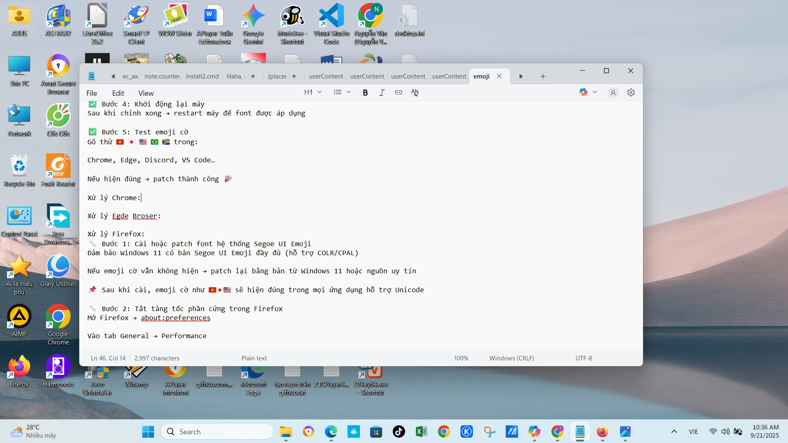

# unicode-flags-for-windows 🇻🇳

Tuannvbg – người Việt Nam quyết tâm và làm bằng được emoji quốc kỳ phải hiển thị đúng trên Windows 😎🇻🇳🇺🇸

---

## 🇻🇳 Tiếng Việt

### ✨ Giới thiệu
Windows 10 và 11 không hiển thị đầy đủ emoji quốc kỳ Unicode (ví dụ: 🇻🇳 🇺🇸 🇯🇵 🇫🇷 🇩🇪). Repo này cung cấp giải pháp triệt để để khắc phục – từ patch font hệ thống đến cấu hình trình duyệt.

Không chờ Microsoft. Không làm nửa vời. Đây là bản patch của niềm tin và tư duy kỹ thuật Việt Nam.

### 🔧 Tính năng
- Patch font `Segoe UI Emoji` đầy đủ COLR/CPAL
- Sửa Registry để Windows nhận font mới
- Tối ưu cho Chrome, Edge, Firefox
- Giữ độ nét chữ thường, spacing chuẩn
- Hỗ trợ cả Windows 10 & Windows 11

---

## 🇺🇸 English

### ✨ Overview
Windows 10 and 11 do not natively support full Unicode flag emojis (e.g. 🇻🇳 🇺🇸 🇯🇵 🇫🇷 🇩🇪). This repository provides a complete solution to patch your system and make flag emojis render properly across all applications.

No waiting for Microsoft updates. No half-measures. This is a full technical fix built with persistence, system-level understanding, and community support.

---

## 🇨🇳 中文（简体）

### ✨ 简介
Windows 10 和 11 默认不支持完整的 Unicode 国旗表情符号（例如 🇻🇳 🇺🇸 🇯🇵 🇫🇷 🇩🇪）。本项目提供完整解决方案，修补系统字体，使国旗表情在所有应用中正确显示。

不等待微软更新。不做半吊子修复。这是由越南开发者 Tuannvbg 构建的彻底技术解决方案。

---

## 🇷🇺 Русский

### ✨ Обзор
Windows 10 и 11 по умолчанию не поддерживают полные флаговые эмодзи Unicode (например 🇻🇳 🇺🇸 🇯🇵 🇫🇷 🇩🇪). Этот репозиторий предлагает полное решение для исправления системы и корректного отображения флагов во всех приложениях.

Без ожидания обновлений от Microsoft. Без полумер. Это техническое решение от Tuannvbg — разработчика из Вьетнама, сделавшего всё, чтобы флаги отображались правильно.

---

## 📸 Screenshots

### ✅ Copilot PC App
> Emoji flags rendered correctly in Copilot PC app on Windows 11  

### ✅ Notepad
> Even the simplest app now displays Unicode flags properly  

### ✅ Visual Studio Code
> VS Code shows full emoji flags in markdown and code comments  

### ✅ Chrome Browser
> Chrome renders emoji flags perfectly after patch  

### ✅ Microsoft Edge
> Edge displays emoji flags in Copilot Web and multilingual content  

### ✅ Firefox Browser
> Firefox still fails to render Unicode flag emojis correctly  

---

## 🙌 Credits
- [`Chasmical/flag-emojis-for-windows`](https://github.com/Chasmical/flag-emojis-for-windows)
- [`perguto/Country-Flag-Emojis-for-Windows`](https://github.com/perguto/Country-Flag-Emojis-for-Windows)
- [`llccd.eu.org`](https://llccd.eu.org/2022/02/win_flags)
- [`13rac1/twemoji-color-font`](https://github.com/13rac1/twemoji-color-font)
- Copilot AI – technical brainstorming partner

---

## 💬 Author
Tuannvbg – the first Vietnamese developer to make Unicode flag emojis display correctly on Windows 😎🇻🇳🇺🇸

---

## 📄 License
This project is licensed under the MIT License – feel free to use, modify, and share it to help Unicode flag emojis display correctly across Windows systems.
