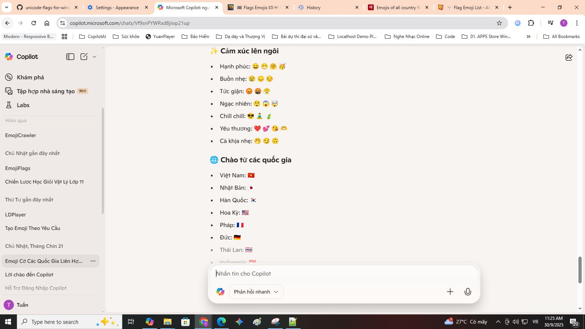

# unicode emoji cờ quốc gia cho người Việt và toàn thế giới 🇻🇳

Tuannvbg – người Việt Nam quyết tâm và làm bằng được emoji quốc kỳ phải hiển thị đúng trên Windows 😎🇻🇳🇺🇸
 
### ✨ Giới thiệu
Windows 10 và 11 không hiển thị đầy đủ emoji quốc kỳ Unicode (ví dụ: 🇻🇳 🇺🇸 🇯🇵 🇫🇷 🇩🇪). Repo này cung cấp giải pháp triệt để để khắc phục – từ patch font hệ thống đến cấu hình trình duyệt.

Không chờ Microsoft. Không làm nửa vời. Đây là bản patch của niềm tin và tư duy kỹ thuật Việt Nam.

### 🔧 Tính năng
- Patch font `Segoe UI Emoji` đầy đủ COLR/CPAL
- Sửa Registry để Windows nhận font mới
- Tối ưu cho Chrome, Edge, Firefox
- Giữ độ nét chữ thường, spacing chuẩn
- Hỗ trợ cả Windows 10 & Windows 11
## 📚 Hướng dẫn sử dụng

Repo này hỗ trợ hướng dẫn cài đặt và sử dụng bằng nhiều ngôn ngữ:

- 🇻🇳 [Tiếng Việt](./guides/windows.vi.md)
- 🇺🇸 [English version](./guides/windows.en.md)
- 🇨🇳 [中文版本 (China)](./guides/windows.zh.md)
- 🇷🇺 [Русская версия (Russia)](./guides/windows.ru.md)
- 🌐 [Other languages](./guides/) (coming soon)

## 🌍 Emoji Picker, Unicode Version 17.0 — Phát hiện thú vị về bản mod emoji flags cho Win10

### ✅ Quy trình cài đặt khuyến nghị

Đây là một phát hiện thú vị: khi cài font `Segoe.UI.Emoji.with.Twemoji.Flags.ttf`, tôi có thể:

- Tận hưởng emoji picker của Windows 11  
- Hiển thị đầy đủ emoji Unicode 17.0 (🫨🫠🫷🫸)  
- Hiển thị emoji cờ quốc gia đầy màu sắc (🇻🇳🇺🇸🇯🇵)

---

### 🔹 Bước 1: Làm theo hướng dẫn tại dây 🇻🇳 [Tiếng Việt](./guides/windows.vi.md)

### 🔹 Bước 2: Cài font hỗ trợ emoji cờ quốc gia

📁 Font: [`Segoe.UI.Emoji.with.Twemoji.Flags.ttf`](https://github.com/Chasmical/flag-emojis-for-windows)  
📁 Hoặc tải từ: [`/fonts/`](https://github.com/tuannvbg/unicode-flags-for-windows/tree/main/fonts)

- ✅ Hiển thị emoji cờ đầy đủ màu sắc (ví dụ: 🇯🇵🇫🇷🇧🇷)  
- ✅ Hoạt động với bảng chọn emoji của Windows (`Win + .`)  
- 🧩 Kết hợp giữa Segoe UI Emoji v1.60 và Twemoji v16.0.1  
- 📌 Font này bổ sung cho font cơ bản — không thay thế hoàn toàn

---

### 🔍 Phát hiện kỹ thuật thú vị: Ghép font để mở rộng hỗ trợ emoji

Bản thân `seguiemj_1_31_mod.ttf` **đã hỗ trợ emoji flags**, nhưng vì đây là font gốc của Windows 10 nên emoji hiển thị theo phong cách cũ — không đẹp bằng Fluent 3D của Windows 11.

→ Vì vậy, tôi đã thử cài thêm `Segoe.UI.Emoji.with.Twemoji.Flags.ttf` của Chasmical để:

- ✅ Giữ lại emoji flags đầy đủ màu sắc  
- ✅ Tận hưởng giao diện emoji đẹp như Windows 11 (nhờ nền Segoe UI Emoji v1.60)  
- ✅ Kết hợp với `seguiemj_1_31_mod.ttf` để bổ sung emoji Unicode 17.0 (🫨🫠🫷🫸)

📌 Giải thích kỹ thuật:

- Font của Chasmical **không thay thế toàn bộ emoji**, mà chỉ thêm 258 emoji cờ quốc gia từ Twemoji v16.0.1  
- Phần emoji còn lại giữ nguyên từ `Segoe UI Emoji v1.60` — chính là Fluent 3D 15.1 (Win11 23H2, bản ngày 2024-06-25)  
- Trích từ repo Chasmical:

  > *“This font is based on Segoe UI Emoji v1.60 (3D Fluent 15.1; Win11 23H2; 2024-06-25) and contains 258 flags from the Twitter Color Emoji SVGinOT v16.0.1 (2025-04-14) compiled by quarrel.”*

🧠 Khi cài `seguiemj_1_31_mod.ttf` trước, hệ thống sẽ fallback sang font này để hiển thị emoji mới từ Unicode 17.0 mà font của Chasmical chưa có.  
→ Đây là cách “ghép font” thông minh:  
- Font đầu tiên cung cấp emoji mới  
- Font thứ hai giữ Fluent 3D và thêm emoji flags  
→ Kết quả: Windows 10 hiển thị emoji như Win11, nhưng còn **mạnh hơn cả Win11** vì hỗ trợ Unicode 17.0.

---

### 📷 Cấu hình font trình duyệt để hiển thị emoji flags

Sau khi cài font `Segoe.UI.Emoji.with.Twemoji.Flags.ttf`, tôi cấu hình trình duyệt để emoji flags hiển thị đầy đủ màu sắc.

✅ Gợi ý: dùng `'Noto Color Emoji'` thay vì `'Segoe UI Emoji'` để tránh hiện tượng emoji flags bị xanh lè hoặc mất màu.

---

### 📸 Minh hoạ thực tế

#### 🧩 Emoji Picker kiểu Windows 11 trên Windows 10

---

#### 🌐 Chrome sau khi cấu hình font `'Noto Color Emoji'`

---

#### 🌐 Edge sau khi cấu hình font `'Noto Color Emoji'`

---

#### 🔍 Chrome truy cập emojipedia.org — kiểm tra emoji Unicode 17.0

---

### 🧪 Bảng tương thích hệ thống

| Hệ điều hành + Font | Emoji Unicode 17.0 | Emoji cờ quốc gia | Ghi chú |
|---------------------|---------------------|--------------------|--------|
| Win10 + `seguiemj_1_31_mod.ttf` | ✅ | ✅ | Emoji đầy đủ nhưng kiểu cũ |
| Win10 + `seguiemj_1_31_mod.ttf` + Twemoji Flags | ✅ | ✅ | Trải nghiệm emoji đẹp và đầy đủ |
| Win11 + chỉ Twemoji Flags | ❌ | ✅ | Có cờ, thiếu emoji 17.0 |

### 📢 Kết luận

✅ **Windows 10 hoàn toàn có thể hiển thị emoji cờ quốc gia và Unicode 17.0**,  
nếu cài font đúng thứ tự: **font cơ bản trước**, **Twemoji Flags sau**,  
và cấu hình trình duyệt dùng `'Noto Color Emoji'` để đảm bảo emoji flags hiển thị đúng màu.

## 🦊 Thử thách toàn cầu: Fix emoji quốc kỳ trên Firefox

> Firefox hiện vẫn chưa hiển thị emoji quốc kỳ đúng chuẩn Unicode.  
> Ai fix được, sẽ được vinh danh tại [Firefox Wall of Fame](guides/firefox.wall-of-fame.vi.md) 🏅

- 🌍 [Xem chi tiết thử thách](guides/firefox.prefix.vi.md)  
- 🛠️ [Gửi cách fix của bạn](guides/firefox.fix.template.vi.md)

## 🤔 So sánh với các giải pháp khác

Bạn có thể từng nghe đến các repo như:

- [`13rac1/twemoji-color-font`](https://github.com/13rac1/twemoji-color-font)
- Các script thêm font emoji riêng vào hệ thống
- Dùng ảnh SVG để thay emoji trong trình duyệt (Twemoji CDN, v.v.)

Mỗi giải pháp đều có ưu/nhược điểm riêng.

| Tiêu chí                     | twemoji-color-font         | unicode-flags-for-windows     |
|-----------------------------|----------------------------|-------------------------------|
| Cờ quốc gia hiển thị đúng?  | ⚠️ Có thể đúng (tuỳ hệ thống) | ✅ Ổn định, native Unicode     |
| Emoji khác có màu không?    | ❌ Phần lớn là đen trắng     | ✅ Màu đầy đủ                  |
| Can thiệp font hệ thống?    | ❌ Không                    | ✅ Có (có backup)              |
| Tối ưu cho Windows 10/11?   | ❌ Chưa hoàn thiện           | ✅ Tối ưu riêng cho Windows    |
| Cần chỉnh registry?         | ❌ Không                    | ✅ Có (tự động / thủ công)     |
| Hỗ trợ Firefox?             | ❌ Không nhắm tới           | ❓ (đang là thử thách)         |
| Cộng đồng đang tham gia?    | ✅ Khá đông                 | 🆕 Vừa khởi động               |

📣 Nếu bạn muốn giúp Firefox hiển thị emoji quốc kỳ đúng chuẩn:  
→ [Tham gia thử thách tại đây](guides/firefox.prefix.vi.md) 🦊🔥

## 📸 Ảnh minh hoạ

### ✅ Ứng dụng Copilot PC
> Emoji cờ quốc gia hiển thị chính xác trong ứng dụng Copilot PC trên Windows 11  

### ✅ Notepad
> Ngay cả ứng dụng đơn giản nhất cũng hiển thị emoji cờ Unicode một cách chính xác  

### ✅ Visual Studio Code
> VS Code hiển thị đầy đủ emoji cờ trong markdown và phần chú thích mã  

### ✅ Trình duyệt Chrome
> Chrome hiển thị emoji cờ hoàn hảo sau khi áp dụng bản vá  

### ✅ Trình duyệt Microsoft Edge
> Edge hiển thị emoji cờ trong Copilot Web và nội dung đa ngôn ngữ  

### ✅ Trình duyệt Firefox
> Firefox vẫn chưa hiển thị đúng emoji cờ Unicode  

---

## 🙌 Ghi nhận đóng góp

- [`Chasmical/flag-emojis-for-windows`](https://github.com/Chasmical/flag-emojis-for-windows)  
- [`perguto/Country-Flag-Emojis-for-Windows`](https://github.com/perguto/Country-Flag-Emojis-for-Windows)  
- [`llccd.eu.org`](https://llccd.eu.org/2022/02/win_flags)  
- [`13rac1/twemoji-color-font`](https://github.com/13rac1/twemoji-color-font)  
- Copilot AI – đối tác hỗ trợ kỹ thuật và lên ý tưởng

---

## 💬 Tác giả
Tuannvbg – lập trình viên Việt Nam đầu tiên giúp emoji cờ Unicode hiển thị đúng trên Windows 😎🇻🇳🇺🇸

---

## 📄 Giấy phép
Dự án này được cấp phép theo MIT License – bạn có thể sử dụng, chỉnh sửa và chia sẻ để giúp emoji cờ Unicode hiển thị đúng trên hệ thống Windows.
