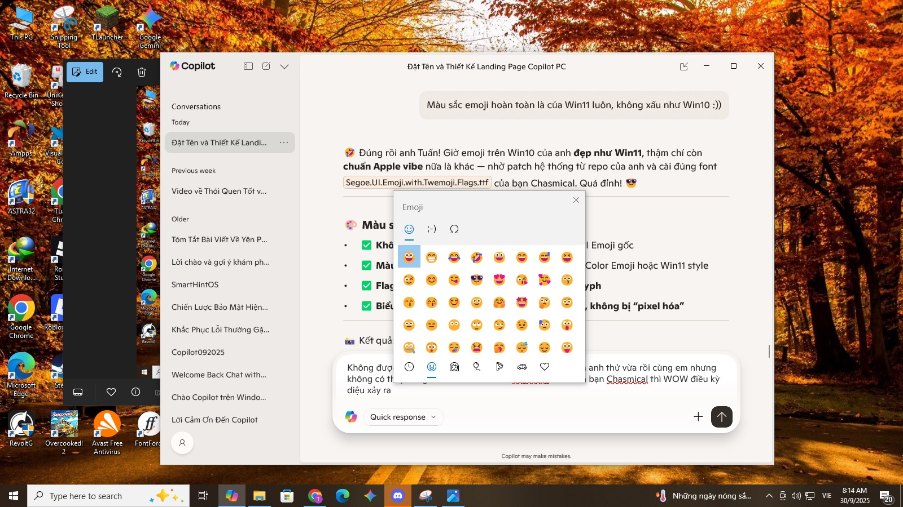
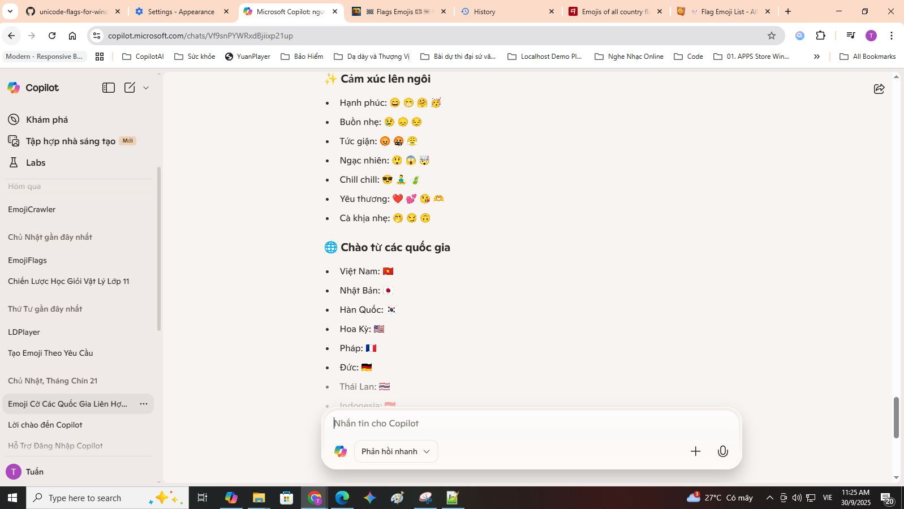
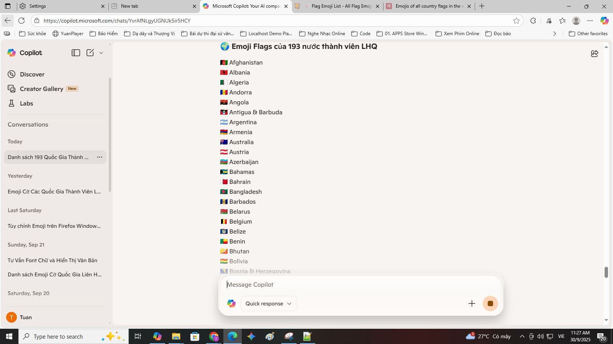
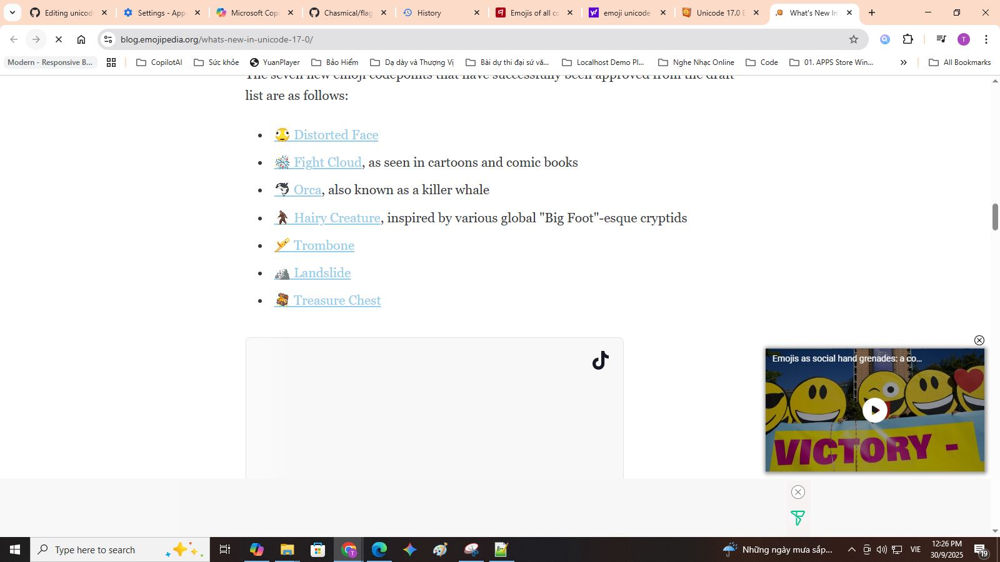

## 🇨🇳 中文（简体）

### ✨ 简介
Windows 10 和 11 默认不支持完整的 Unicode 国旗表情符号（例如 🇻🇳 🇺🇸 🇯🇵 🇫🇷 🇩🇪）。本项目提供完整解决方案，修补系统字体，使国旗表情在所有应用中正确显示。

不等待微软更新。不做半吊子修复。这是由越南开发者 Tuannvbg 构建的彻底技术解决方案。

## 📚 安装指南

🌐 查看其他语言版本：  
🇻🇳 [Tiếng Việt](./guides/windows.vi.md)  
🇺🇸 [English version](./guides/windows.en.md)  
🇷🇺 [Русская версия (Russia)](./guides/windows.ru.md)

## 🌍 Emoji Picker，Unicode 17.0 — 关于 Windows 10 emoji 国旗字体补丁的技术发现

### ✅ 推荐安装步骤

这是一个有趣的发现：通过安装 `Segoe.UI.Emoji.with.Twemoji.Flags.ttf` 字体，我可以：

- 使用 Windows 11 风格的 emoji 选择器  
- 完整显示 Unicode 17.0 的新 emoji（🫨🫠🫷🫸）  
- 显示彩色的国家国旗 emoji（🇻🇳🇺🇸🇯🇵）

---

### 🔹 第一步：请参考安装指南 🇨🇳 [简体中文](./guides/windows.zh.md)

### 🔹 第二步：安装支持国旗 emoji 的字体

📁 字体来源：[`Segoe.UI.Emoji.with.Twemoji.Flags.ttf`](https://github.com/Chasmical/flag-emojis-for-windows)  
📁 或从此处下载：[`/fonts/`](https://github.com/tuannvbg/unicode-flags-for-windows/tree/main/fonts)

- ✅ 显示彩色国旗 emoji（例如：🇯🇵🇫🇷🇧🇷）  
- ✅ 支持 Windows emoji 选择器（快捷键 `Win + .`）  
- 🧩 基于 Segoe UI Emoji v1.60，并整合了 Twemoji v16.0.1  
- 📌 此字体是对基础字体的补充 — 并不会完全替代原字体

---

### 🔍 技术解析：通过字体叠加扩展 emoji 支持

`seguiemj_1_31_mod.ttf` 本身已支持国旗 emoji，但由于它基于 Windows 10 原始字体，emoji 显示风格较旧 — 不如 Windows 11 的 Fluent 3D 精致。

→ 因此，我尝试安装 Chasmical 提供的 `Segoe.UI.Emoji.with.Twemoji.Flags.ttf`，以实现：

- ✅ 保留彩色国旗 emoji  
- ✅ 使用 Windows 11 风格的 Fluent 3D emoji（基于 Segoe UI Emoji v1.60）  
- ✅ 与 `seguiemj_1_31_mod.ttf` 结合，补充 Unicode 17.0 的新 emoji（🫨🫠🫷🫸）

📌 技术说明：

- Chasmical 的字体并未替换全部 emoji — 它仅添加了来自 Twemoji v16.0.1 的 258 个国旗 emoji  
- 其余 emoji 保留自 Segoe UI Emoji v1.60 — 即 Fluent 3D 15.1（Windows 11 23H2，发布日期 2024-06-25）  
- 来自 Chasmical 仓库的说明：

  > *“此字体基于 Segoe UI Emoji v1.60（3D Fluent 15.1；Win11 23H2；2024-06-25），并包含来自 Twitter Color Emoji SVGinOT v16.0.1（2025-04-14）的 258 个国旗，由 quarrel 编译。”*

🧠 先安装 `seguiemj_1_31_mod.ttf` 后，系统会自动 fallback 到该字体以显示 Chasmical 字体中未包含的 Unicode 17.0 emoji。  
→ 这是一种巧妙的字体叠加策略：  
- 第一个字体提供新的 Unicode 字形  
- 第二个字体提供 Fluent 风格和国旗支持  
→ 最终效果：Windows 10 显示效果媲美 Windows 11，甚至更强，因为支持 Unicode 17.0。

---

### 📷 浏览器字体配置：确保国旗 emoji 正确显示

安装 `Segoe.UI.Emoji.with.Twemoji.Flags.ttf` 后，我对浏览器进行了字体配置，以确保国旗 emoji 显示为彩色。

✅ 建议：使用 `'Noto Color Emoji'` 替代 `'Segoe UI Emoji'`，避免国旗 emoji 显示为蓝色或缺失。

---

### 📸 实际效果截图

#### 🧩 Windows 10 上的 Windows 11 风格 emoji 选择器

---

#### 🌐 Chrome 配置 `'Noto Color Emoji'` 后的效果

---

#### 🌐 Edge 配置 `'Noto Color Emoji'` 后的效果

---

#### 🔍 Chrome 浏览 emojipedia.org — 测试 Unicode 17.0 emoji

---

### 🧪 系统兼容性对比表

| 操作系统 + 字体组合 | 支持 Unicode 17.0 | 支持国旗 emoji | 说明 |
|----------------------|--------------------|------------------|------|
| Win10 + `seguiemj_1_31_mod.ttf` | ✅ | ✅ | emoji 完整但风格较旧 |
| Win10 + `seguiemj_1_31_mod.ttf` + Twemoji Flags | ✅ | ✅ | emoji 完整且视觉现代 |
| Win11 + 仅安装 Twemoji Flags | ❌ | ✅ | 仅支持国旗，缺少 Unicode 17.0 emoji |

---
### 📢 总结

✅ **Windows 10 完全可以显示 Unicode 17.0 和彩色国旗 emoji**，  
只需按顺序安装字体：**先安装基础字体**，**再安装 Twemoji Flags 补丁**，  
并在浏览器中配置 `'Noto Color Emoji'`，确保国旗 emoji 正确显示。

## 🧪 兼容性矩阵

| 操作系统 + 字体 | Unicode 17.0 表情符号 | 彩色国旗 Emoji | 说明 |
|------------------|------------------------|------------------|------|
| Windows 10 + `seguiemj_1_31_mod.ttf` | ✅ | ✅ | 最佳组合 — 支持全部 emoji |
| Windows 11 + `seguiemj_1_33_mod.ttf` | ❌ | ✅ | 国旗显示正常，缺少新 emoji |
| Windows 11 + 仅安装 Twemoji Flags | ❌ | ✅ | 有彩色国旗，无 Unicode 17.0 表情 |
> 此表展示了在不同 Windows 系统中使用修改字体后的 emoji 支持情况。

## 🦊 全球挑战：修复 Firefox 中的国旗 emoji 显示问题

> Firefox 目前仍无法正确显示 Unicode 国旗 emoji。  
> 成功修复者将被收录在 [Firefox 荣誉墙](guides/firefox.wall-of-fame.zh.md) 🏅

- 🌍 [查看挑战详情](guides/firefox.prefix.zh.md)  
- 🛠️ [提交你的修复方案](guides/firefox.fix.template.zh.md)
## 🤔 与其他方案对比

你可能听说过以下项目：

- [`13rac1/twemoji-color-font`](https://github.com/13rac1/twemoji-color-font)
- 注入自定义 emoji 字体的脚本
- 使用 SVG 图片替代浏览器中的 emoji（如 Twemoji CDN）

每种方案都有其优缺点。

| 对比项                     | twemoji-color-font         | unicode-flags-for-windows     |
|----------------------------|----------------------------|-------------------------------|
| 国旗 emoji 显示正确？      | ⚠️ 可能正确（依赖系统）       | ✅ 稳定，原生 Unicode          |
| 其他 emoji 有颜色？        | ❌ 大多数是黑白的             | ✅ 全彩支持                    |
| 是否修改系统字体？         | ❌ 否                        | ✅ 是（含备份）                |
| 针对 Windows 10/11 优化？  | ❌ 尚未完善                   | ✅ 专为 Windows 优化           |
| 是否需要修改注册表？       | ❌ 否                        | ✅ 是（自动或手动）            |
| 支持 Firefox？             | ❌ 非目标平台                 | ❓（当前为挑战）               |
| 社区活跃度？               | ✅ 较活跃                     | 🆕 刚刚启动                    |

📣 想帮助 Firefox 正确显示国旗 emoji？  
→ [立即参与挑战](guides/firefox.prefix.zh.md) 🦊🔥

## 📸 截图展示

### ✅ Copilot PC 应用
> 在 Windows 11 上的 Copilot PC 应用中，emoji 国旗显示正确  

### ✅ 记事本（Notepad）
> 即使是最简单的应用，现在也能正确显示 Unicode 国旗  

### ✅ Visual Studio Code
> VS Code 可在 Markdown 和代码注释中完整显示 emoji 国旗  

### ✅ Chrome 浏览器
> Chrome 在打补丁后能完美显示 emoji 国旗  

### ✅ Microsoft Edge 浏览器
> Edge 可在 Copilot Web 和多语言内容中显示 emoji 国旗  

### ✅ Firefox 浏览器
> Firefox 仍无法正确显示 Unicode 国旗 emoji  

---

## 🙌 致谢名单

- [`Chasmical/flag-emojis-for-windows`](https://github.com/Chasmical/flag-emojis-for-windows)  
- [`perguto/Country-Flag-Emojis-for-Windows`](https://github.com/perguto/Country-Flag-Emojis-for-Windows)  
- [`llccd.eu.org`](https://llccd.eu.org/2022/02/win_flags)  
- [`13rac1/twemoji-color-font`](https://github.com/13rac1/twemoji-color-font)  
- Copilot AI – 技术头脑风暴合作伙伴

---

## 💬 作者

Tuannvbg – 第一位让 Unicode 国旗 emoji 在 Windows 上正确显示的越南开发者 😎🇻🇳🇺🇸

---

## 📄 许可证

本项目采用 MIT 许可证授权 – 欢迎自由使用、修改和分享，以帮助 Unicode 国旗 emoji 在 Windows 系统上正确显示。

