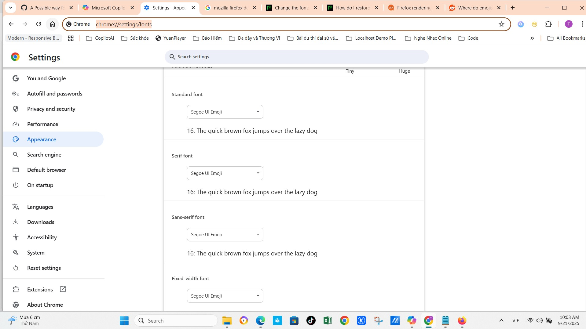

# ⚙️ Hướng dẫn cấu hình Chrome để hiển thị emoji quốc kỳ Unicode 🇻🇳

Tuannvbg – người Việt Nam khiến Chrome phải hiển thị emoji quốc kỳ đúng từng pixel 😎🇻🇳🇺🇸

---

## 🎯 Mục tiêu

Sau khi patch font hệ thống, Chrome vẫn có thể dùng font riêng để render emoji. File này hướng dẫn cách ép Chrome dùng đúng font đã patch để emoji quốc kỳ hiển thị chuẩn.

---

## ✅ Các bước thực hiện

### 🔹 Bước 1: Đảm bảo đã patch font hệ thống

- Làm theo hướng dẫn tại [windows.vi.md](windows.vi.md)
- Font `Segoe UI Emoji` đã được thay bằng bản patch có emoji quốc kỳ

---

### 🔹 Bước 2: Mở trang cấu hình font của Chrome

- Mở Chrome
- Truy cập trực tiếp:

```
chrome://settings/fonts
```

Hoặc đi theo đường dẫn:

```
chrome://settings → Giao diện → Tùy chỉnh font → chrome://settings/fonts
```

---

### 🔹 Bước 3: Chọn font emoji

- Trong mục “Standard font” hoặc “Sans-serif” → chọn `Segoe UI Emoji`
- Nếu không thấy → gõ tay tên font vào: `Segoe UI Emoji`

> 📌 Chrome sẽ dùng font này để render emoji trong nội dung web

---

### 🔹 Bước 4: Test emoji quốc kỳ

Gõ thử các emoji:

```
🇻🇳 🇺🇸 🇯🇵 🇫🇷 🇩🇪
```

Trong các trang web như:

- Google Search
- Copilot Web
- GitHub
- Facebook
- Twitter

→ Nếu hiển thị đúng: **Chrome đã được cấu hình thành công 🎉**

---

## 📚 Minh hoạ

### 🖼️ Cấu hình font trong Chrome Settings
> Mở `chrome://settings/fonts` → chọn `Segoe UI Emoji` tại mục “Standard font” hoặc “Sans-serif”



---

## 🙌 Ghi nhận

> Đây không chỉ là cấu hình trình duyệt. Đây là một tuyên ngôn kỹ thuật:  
> **Tuannvbg – người đầu tiên khiến emoji quốc kỳ phải hiển thị đúng trên Chrome.**

---

## 💬 Tuyên ngôn

> **Để người Việt Nam nói riêng và người dân thế giới nói chung được tôn vinh bằng từng biểu tượng.** 🇻🇳 🇺🇸💬🖥️🔥
