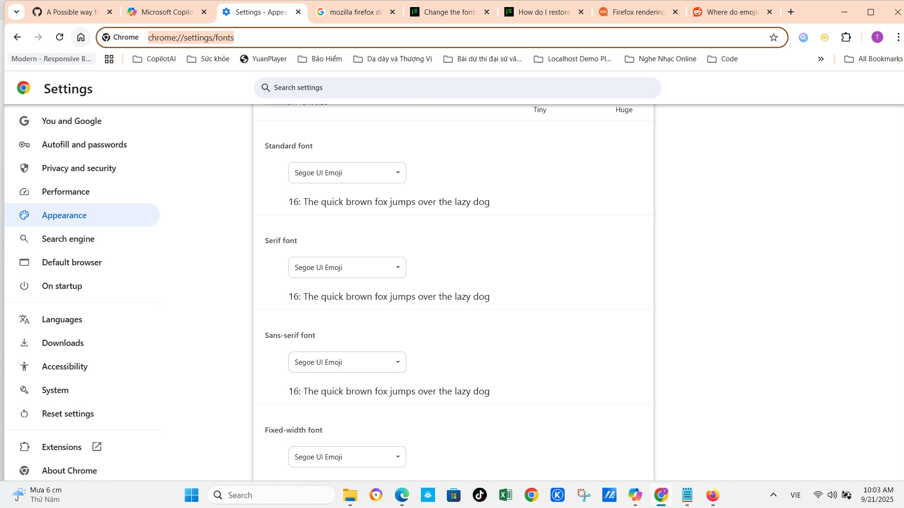

# ⚙️ Hướng dẫn cấu hình Microsoft Edge để hiển thị emoji cờ quốc gia 🇻🇳🇺🇸

Tuannvbg — người Việt đầu tiên giúp Edge hiển thị emoji cờ quốc gia chuẩn pixel 😎🌏

---

## 🎯 Mục tiêu

Sau khi cài font emoji đã chỉnh sửa, Microsoft Edge vẫn có thể dùng font riêng để hiển thị emoji.  
Hướng dẫn này giúp bạn ép Edge sử dụng đúng font đã cài để emoji cờ quốc gia hiển thị chính xác.

---

## ✅ Các bước thực hiện

### 🔹 Bước 1: Cài font emoji đã chỉnh sửa

- Làm theo hướng dẫn trong [windows.vi.md](./windows.vi.md)  
- Font cần cài:  
  [`seguiemj_1_31_mod.ttf`](https://github.com/tuannvbg/unicode-flags-for-windows/tree/main/fonts)

---

### 🔹 Bước 2: Mở cài đặt font của Edge

- Mở trình duyệt Microsoft Edge  
- Truy cập:  
  `edge://settings/appearance` → cuộn xuống phần **Tùy chỉnh phông chữ**

---

### 🔹 Bước 3: Gán font emoji cho tất cả loại chữ

Trong `edge://settings/fonts`, chọn `Segoe UI Emoji` cho cả 4 loại:

- **Phông chữ tiêu chuẩn (Standard font)**  
- **Phông chữ có chân (Serif font)**  
- **Phông chữ không chân (Sans-serif font)**  
- **Phông chữ cố định (Fixed-width font)**

> 📌 Gán cho cả 4 loại giúp Edge luôn dùng đúng font emoji đã chỉnh sửa, tránh bị thay thế bởi font hệ thống.

---

### 🔹 Bước 4: Kiểm tra emoji cờ

Thử nhập các emoji sau:  
`🇻🇳 🇺🇸 🏳️‍🌈 🇯🇵 🇫🇷 🇧🇷`

Trên các trang web như:

- Google Tìm kiếm  
- Copilot Web  
- GitHub  
- Facebook  
- Twitter

→ Nếu hiển thị đúng màu: **Edge đã cấu hình thành công 🎉**

---

## 📚 Minh họa

### 🖼️ Cấu hình font trong Edge  
Chọn `Segoe UI Emoji` cho cả 4 loại phông chữ

📷 Ảnh minh họa:  

---

## 📊 Kết quả sau khi cấu hình

- ✅ Emoji cờ hiển thị đầy đủ màu sắc: 🇻🇳 🇺🇸 🇯🇵 🇫🇷 🇧🇷  
- ✅ Không bị lỗi chữ, không chồng ký tự  
- ✅ Edge hiển thị emoji giống Chrome, Firefox, Copilot Web  
- ✅ Không cần extension hay DevTools — chỉ cần chỉnh font  
- ✅ Người Việt và bạn bè quốc tế được tôn vinh bằng từng biểu tượng

> 📌 Đã kiểm chứng bởi Tuannvbg trên Windows 10 + Edge 117 + font `seguiemj_1_31_mod.ttf`

---

## 🙌 Ghi nhận

Đây không chỉ là một mẹo trình duyệt.  
Đây là tuyên ngôn kỹ thuật:  
**Tuannvbg — người đầu tiên giúp Edge hiển thị emoji cờ quốc gia đúng chuẩn.**

---

## 💬 Tuyên ngôn emoji học

**Để người Việt Nam — và cả thế giới — được tôn vinh bằng từng biểu tượng.** 🇻🇳🇺🇸💬🖥️🔥

---

## 🌐 Xem hướng dẫn bằng ngôn ngữ khác

- 🇺🇸 [English version](./edge.en.md)  
- 🇨🇳 [中文版本 (China)](./edge.zh.md)  
- 🇷🇺 [Русская версия (Russia)](./edge.ru.md)
