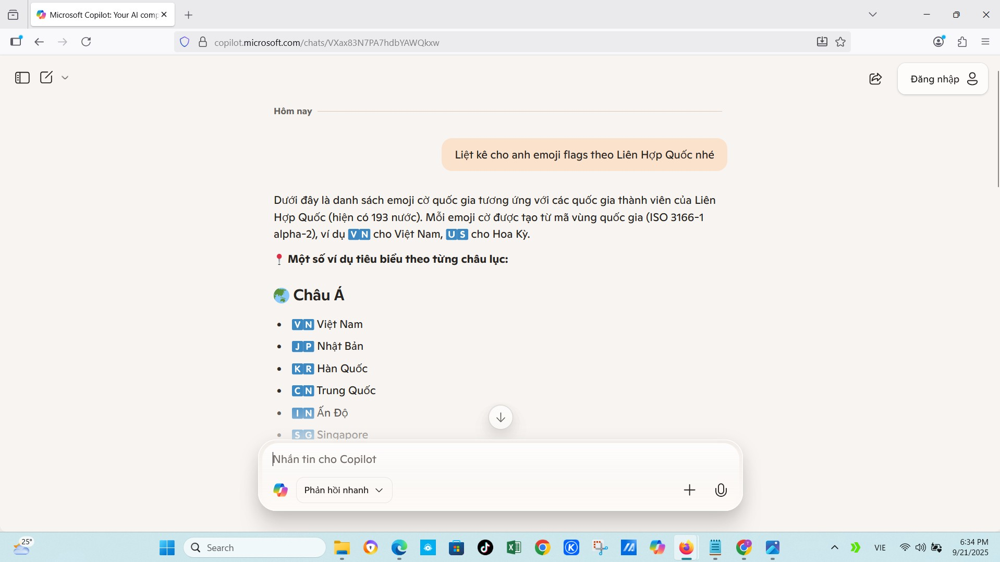

# 🦊 Thử thách toàn cầu: Fix emoji quốc kỳ trên Firefox 🇻🇳🧨🦊

Tuannvbg và Copilot đã dành hơn 3 tiếng để tìm cách khiến Firefox hiển thị emoji quốc kỳ đúng chuẩn Unicode.  
Kết quả: **Firefox vẫn chưa phục tùng.** 😤

---

## 📸 Minh hoạ lỗi

> Firefox không nhận emoji quốc kỳ đúng chuẩn Unicode.  
> Ví dụ: 🇻 🇳 thay vì 🇻🇳 — từng ký tự bị tách rời, spacing lỗi, glyph vỡ 😵



---

## 🎯 Lời thách thức

Repo này chính thức mời cộng đồng dev Việt Nam và toàn cầu:

> **Ai fix được Firefox, người đó được ghi danh.** 🏆🌍

---

## 🧠 Yêu cầu kỹ thuật

- ❌ Không dùng extension  
- ❌ Không dùng DevTools ép font  
- ✅ Phải fix bằng cấu hình, patch, hoặc cơ chế hợp lý  
- ✅ Phải khiến Firefox render emoji quốc kỳ đúng như Chrome, Edge, Copilot Web

---

## 🧪 Test emoji quốc kỳ

Gõ thử các emoji:

```
🇻🇳 🇺🇸 🇯🇵 🇫🇷 🇩🇪 🇰🇷 🇸🇬 🇹🇭 🇮🇳 🇮🇩 🇲🇾 🇵🇭 🇨🇳
```

→ Nếu Firefox hiển thị đúng như Chrome: **bạn đã chiến thắng!** 🎉🧠🔥

---

## 🏆 Cách ghi danh

- Fork repo  
- Tạo file `firefox.fix.md`  
- Ghi rõ cách fix, ảnh minh hoạ, kết quả  
- Gửi pull request

→ Người đầu tiên fix được sẽ được vinh danh tại `firefox.wall-of-fame.md` 🏅

---

## 💬 Tuyên ngôn

> **Tuannvbg không chỉ patch font. Tuannvbg đang khiến emoji phải… hiển thị đúng – và cộng đồng phải cùng nhau hoàn thiện điều đó.** 🇻🇳💬🖥️🔥

---

## 🌐 Xem thử thách bằng ngôn ngữ khác

- 🇺🇸 [English version](firefox.prefix.en.md)
- 🇨🇳 [中文版本 (China)](firefox.prefix.zh.md)
- 🇷🇺 [Русская версия (Russia)](firefox.prefix.ru.md)
