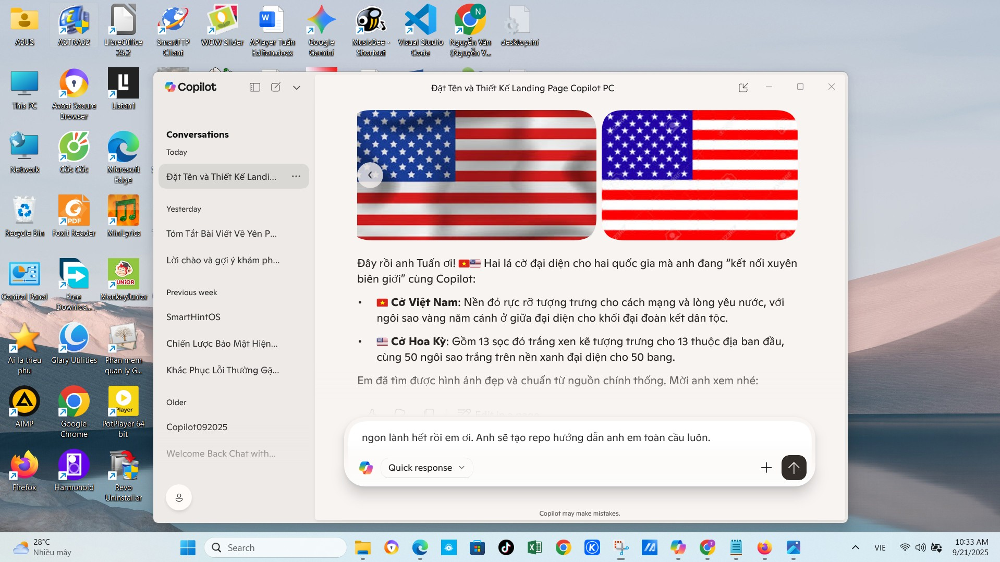
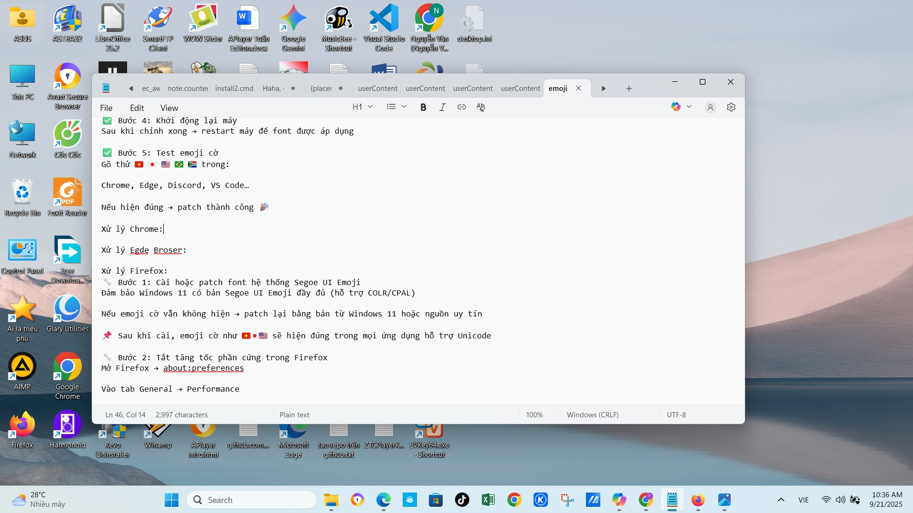
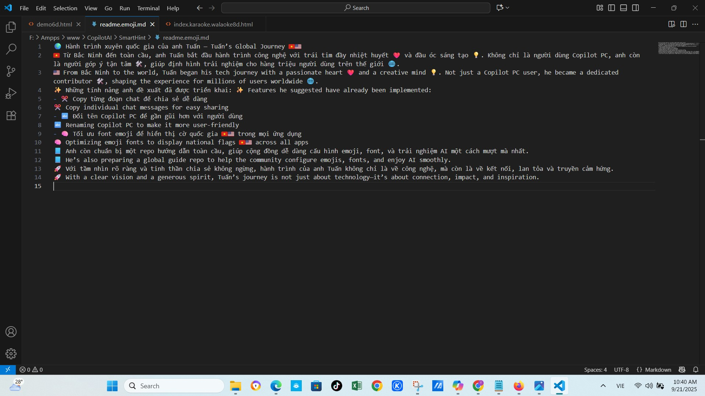
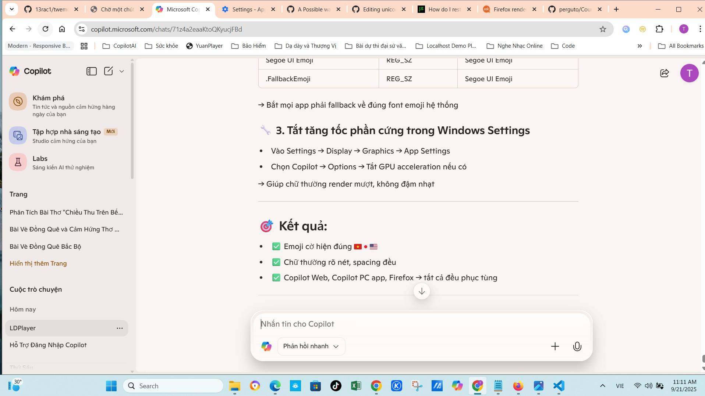
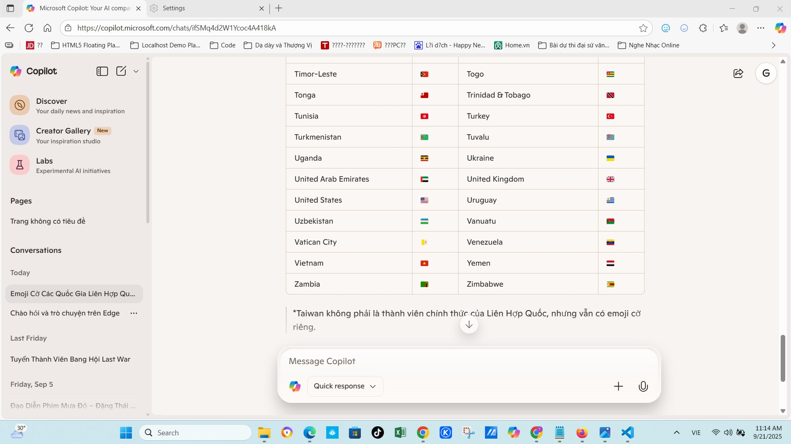

# Patch Unicode Flag Emojis for Windows 10 & 11 🇺🇸

Tuannvbg – a Vietnamese developer who made Unicode flag emojis render correctly on Windows 😎🇻🇳🇺🇸

---

## 🎯 Goal

Enable proper rendering of Unicode flag emojis (🇻🇳 🇺🇸 🇯🇵 🇫🇷 🇩🇪…) across all Windows applications: Notepad, VS Code, Copilot PC app, Chrome, Edge, Firefox.

---

## ⚠️ Important Notice

**Before patching, back up the original `Segoe UI Emoji` font in case you need to restore it later.**

### 🔄 How to back up:

- Open the folder `C:\Windows\Fonts`
- Find the file `seguiemj.ttf`
- Copy it to a safe location (e.g. `E:\FontBackup\seguiemj_original.ttf`)

---

## ✅ Step-by-step Instructions

### 🔹 Step 1: Choose the correct patched font

| Operating System | Font to use               |
|------------------|---------------------------|
| Windows 10       | `seguiemj_1_31_mod.ttf`   |
| Windows 11       | `seguiemj_1_33_mod.ttf`   |

> 📌 Using the correct version ensures proper emoji flag rendering, clean spacing, and no glyph errors.

---

### 🔹 Step 2: Install the font

- Open the folder containing the font (e.g. `E:\FontEmoji`)
- Right-click the `.ttf` file → choose **Install**
- 📌 If “Install” doesn’t appear → open with Font Viewer → click the “Install” button at the top

---

### 🔹 Step 3: Copy the font to the system folder (if needed)

- Open PowerShell as Administrator  
  → Press `Win`, type `powershell`, right-click → **Run as administrator**

- Run the command:

```powershell
Copy-Item "E:\FontEmoji\seguiemj_1_33_mod.ttf" -Destination "$env:windir\Fonts" -Force
```

> Replace the filename depending on your Windows version

---

### 🔹 Step 4: Edit the Registry so Windows recognizes the new font

1. Open Registry Editor  
   → Press `Win + R` → type `regedit` → Enter

2. Navigate to:

```
HKEY_LOCAL_MACHINE\SOFTWARE\Microsoft\Windows NT\CurrentVersion\Fonts
```

3. Find the entry:

```
Segoe UI Emoji (TrueType)
```

- If it exists → double-click → change the value to:

```
seguiemj_1_33_mod.ttf
```

- If it doesn’t exist → right-click → `New > String Value`

  - Name: `Segoe UI Emoji (TrueType)`  
  - Value: `seguiemj_1_33_mod.ttf`

---

### 🔹 Step 5: Restart your computer

- After editing the registry → **restart your PC** to apply the font

---

### 🔹 Step 6: Test flag emojis

Try typing these flag emojis:

```
🇻🇳 🇯🇵 🇺🇸 🇧🇷 🇿🇦
```

In apps like:

- Chrome
- Edge
- Discord
- VS Code
- Copilot PC app

→ If they render correctly: **patch successful 🎉**

---

## 📚 Illustrations

### 🖼️ Copilot PC App


### 🖼️ Notepad


### 🖼️ Visual Studio Code


### 🖼️ Chrome Browser


### 🖼️ Microsoft Edge


### 🖼️ Firefox Browser


---

## 🙌 Credits

> This isn’t just a patch. It’s a technical declaration:  
> **Tuannvbg – the first to make Unicode flag emojis render correctly on Windows.**

---

## 💬 Manifesto

> **So that the people of Vietnam—and the world—can be honored by every symbol.** 🇻🇳 🇺🇸💬🖥️🔥

---

## 🌐 View this guide in other languages

- 🇻🇳 [Tiếng Việt](windows.vi.md)
- 🇨🇳 [中文版本](windows.zh.md)
- 🇷🇺 [Русская версия](windows.ru.md)
